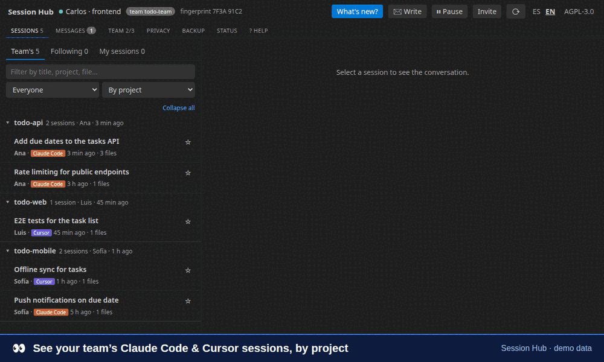
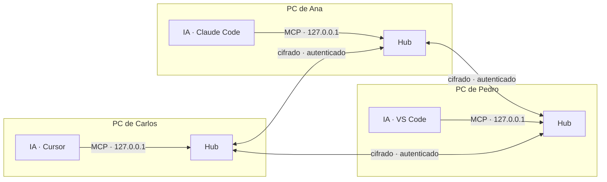

<div align="center">


# Session Hub

**Mira lo que tus compañeros hicieron con su IA, y deja que tu IA les pregunte.**
Comparte las sesiones de Claude Code y Cursor con tu equipo, escríbanse entre ustedes y guarda un respaldo de cada sesión aunque la herramienta la borre: de igual a igual, cifrado de extremo a extremo, con identidades firmadas y un servidor MCP incluido.

[](LICENSE)
[](https://github.com/carlosvisbal/session-hub/releases)
[](https://github.com/carlosvisbal/session-hub/actions/workflows/ci.yml)
[](https://marketplace.visualstudio.com/items?itemName=carlosvisbal.session-hub)
[](https://open-vsx.org/extension/carlosvisbal/session-hub)


[English](README.md) · **Español**



<sub>Datos de demostración.</sub>

</div>

---

## Para qué

Tu compañero del backend pasó la mañana con Claude Code cambiando una API. Tú, en el frontend, te enteras horas después, o nunca. **Session Hub** convierte esas conversaciones con la IA en contexto compartido y fácil de buscar para todo el equipo:

> *"¿Qué cambió Carlos hoy en el backend?"*: se lo preguntas a tu propia IA y te responde con sus sesiones reales.

### Qué abarca

| | |
|---|---|
| 👀 **Ver** | Las sesiones de Claude Code y Cursor de cada compañero (completas y agrupadas por proyecto), quién está en línea y qué sesiones de IA tiene abiertas. |
| ✉️ **Hablar** | Mensajes firmados para un compañero o una de sus sesiones; esa persona decide si pasarlos a su IA. **Conversaciones automáticas**: si los dos aceptan, las dos IA conversan solas mediante los hooks de Claude Code y Cursor, hasta un límite de vueltas y tiempo. |
| 🗄️ **Guardar** | Respaldo local de tus sesiones (Claude Code borra el historial a los 30 días) y copias de lectura de las de tu equipo, con borrar y exportar. |
| 🤖 **Usar** | Cualquier sesión, en vivo, respaldada o copiada, en el chat de tu IA (Claude Code, Copilot o Cursor), con un clic o por MCP. |

Siempre bajo tu control: nada se comparte hasta que tú lo eliges, es de solo lectura y no hay servidor central.

## Qué ofrece

| | |
|---|---|
| 🤝 **Vista de equipo** | Las sesiones de Claude Code y Cursor de todos en un panel: quién pidió qué, qué archivos cambiaron y en qué quedó. |
| 🧠 **MCP incluido** | Tu IA (Cursor, VS Code en modo agente, Claude Code) puede listar, buscar y leer sesiones **completas** de tus compañeros. |
| 🔐 **Identidad firmada** | Cada instalación tiene una clave Ed25519. Nadie puede hacerse pasar por otro, ni con un certificado robado. |
| 🛰️ **Sin servidor central** | Cada persona tiene su propio hub; los hubs hablan directo por Hyperswarm, cifrado con Noise. Funciona en la red local sin internet. |
| 🎛️ **Control personal** | Eliges qué proyectos compartes y con quién, ocultas sesiones sueltas, pausas todo o bloqueas a alguien solo para ti. |
| ✉️ **Mensajes entre personas** | Escríbele a un compañero, o a una de sus sesiones de IA abiertas, desde el panel o pidiéndoselo a tu IA. Van firmados, quedan retenidos hasta que los apruebe y con un clic los pasa a su IA. Nada se ejecuta solo. |
| 🗄️ **Respaldo local** | Tus sesiones siguen disponibles aunque Claude Code (30 días) o Cursor las borren, y puedes guardar copias de las de tu equipo para leerlas sin conexión, solo mientras tengas acceso. Exporta a Markdown o JSON. |
| 👁️ **Transparencia** | Te avisa cuando alguien lee tu sesión: quién, cuál, de qué proyecto y desde qué herramienta. Auditoría de 90 días. |
| 🧹 **Oculta secretos** | Tokens, contraseñas, llaves y URLs con credenciales salen de tu máquina como `[REDACTED]`. |
| 📜 **Software libre** | AGPL‑3.0‑or‑later. El hub en ejecución sirve su propio código en `/source`. |

## Empezar

Busca **Session Hub** en la vista de Extensiones, o:

```bash
code --install-extension carlosvisbal.session-hub      # VS Code, desde el Marketplace
cursor --install-extension carlosvisbal.session-hub    # Cursor, desde Open VSX
```

Está en el [Marketplace de VS Code](https://marketplace.visualstudio.com/items?itemName=carlosvisbal.session-hub) y en [Open VSX](https://open-vsx.org/extension/carlosvisbal/session-hub) (Cursor, VSCodium), y se actualiza sola desde ahí. ¿Prefieres el archivo? Descarga `session-hub.vsix` desde la [última versión](https://github.com/carlosvisbal/session-hub/releases/latest) y ejecuta `code --install-extension session-hub.vsix` (o `cursor …`). No hace falta instalar Node.js: el hub usa el runtime del propio editor.

1. **Crea un equipo** en la barra lateral de Session Hub (solo la primera persona).
2. **Invita:** copia un código `SH2-…` de un solo uso (vale 48 h). Cualquier miembro puede invitar.
3. **Únete:** pega el código. El hub de quien te invitó te confirma solo cuando los dos están conectados.
4. **Comparte un proyecto** y elige quién lo ve.

📘 Guía completa para personas no técnicas: **[docs/MANUAL.es.md](docs/MANUAL.es.md)**

## Cómo funciona



- La API y el MCP de cada persona escuchan **solo en 127.0.0.1**. Tu IA habla solo con tu propio hub.
- Cada hub es el **orquestador de su dueño**: consulta en paralelo a los demás, junta las respuestas e indica de quién es cada una. Un compañero lento no bloquea al resto (10 s por consulta).
- Cada hub responde **solo por lo suyo, con sus propias reglas**, y registra cada lectura.
- La pertenencia al equipo es una **cadena de certificados** que empieza en el fundador: invitación → miembro → admisión. Una invitación filtrada no sirve para una segunda persona.

| Modo de red (`sessionHub.network`) | Para qué | Requiere |
|---|---|---|
| `lan` *(por defecto)* | Red de la oficina; los propios hubs forman la red | UDP `49737` permitido |
| `private` | Remoto o VPN con nodos de arranque propios | `sessionHub.bootstrap` |
| `public` | Remoto sin montar nada | Salida UDP |

**Remoto, paso a paso.** La infraestructura propia (nodos de arranque + un relay ciego que solo reenvía bytes cifrados) se levanta con un comando:

```bash
npm run infra -- --host 203.0.113.10     # imprime los ajustes que pega cada compañero
npm run infra -- --public                # solo relay, sobre la red pública
```

Guía completa: **[Trabajar desde redes distintas](docs/REMOTE.es.md)**. Las VPN (WireGuard, Tailscale, la de la empresa) se detectan y anuncian solas. Si una conexión falla por una política de red (UDP bloqueado, NAT estricto, relay inalcanzable…), Session Hub te dice **por qué** y **Copiar informe de conexión** genera un mensaje listo para enviar a TI.

**Idioma:** la interfaz sigue el idioma del editor (español o inglés); se puede fijar con `sessionHub.language`.

## Herramientas MCP

| Herramienta | Qué hace |
|---|---|
| `list_peers` | Miembros del equipo, quién está en línea, qué comparte contigo y estado de la red |
| `what_changed` | Qué hizo cada compañero desde una fecha: peticiones, archivos, comandos y estado final |
| `list_sessions` | Sesiones por persona, proyecto, fuente y fecha |
| `get_session` | Una sesión **completa**: todos los mensajes, sin recortar |
| `search_sessions` | Búsqueda de texto en lo que tu equipo comparte contigo |
| `list_agents` | Sesiones de IA que cada compañero tiene abiertas ahora (herramienta, proyecto, ocupada o libre) |
| `send_message` | Un mensaje de texto firmado para un compañero (en cola hasta 24 h si está desconectado) |
| `check_inbox` | Los mensajes que aprobaste para tu IA, marcados como de un compañero y no tuyos |
| `start_conversation` / `end_conversation` | Proponer (tú confirmas, el otro acepta) y terminar una conversación automática |

`list_sessions` acepta `origen: "respaldo"` para listar solo lo que viene del respaldo (el original ya se borró) o de copias locales. Cada resultado lleva `projectKey` (mismo repo = misma clave), `archived` y `copy`: la IA no mezcla proyectos y sabe cuándo lee una copia.

**Usar cualquier sesión en cualquier chat:** pulsa **🤖 Usar en mi IA** en una sesión (también en la pestaña *Respaldo*) y el pedido de leerla con `get_session` queda escrito en Claude Code, Copilot o Cursor; solo agregas tu pregunta. O pídeselo directo: *"Lee en Session Hub mi sesión respaldada sobre firmas y resume qué cambió."*

Todas aceptan `peer` (nombre, huella, `"yo"` o `"todos"`). Si no hay resultados, explican *por qué* (nadie en línea o nada compartido).

## Línea de comandos (sin editor)

```bash
npm install
npm run setup -- --name Ana --role frontend /ruta/al/proyecto=mi-api
npm run setup -- team create "equipo-dev"     # o: npm run setup -- team join SH2-…
npm start
npm test
```

## Seguridad

Modelo de amenazas y limitaciones conocidas: **[SECURITY.md](SECURITY.md)**. Reporta vulnerabilidades en privado a **carlosvisbal66@gmail.com**.

## Contribuir

Se aceptan pull requests con [DCO](CONTRIBUTING.md) (`git commit -s`), sin cesión de derechos. Ver [CHANGELOG.md](CHANGELOG.md).

## Licencia

Session Hub es software libre bajo la [GNU Affero General Public License v3.0 o posterior](LICENSE). © 2026 Carlos Visbal y los autores de Session Hub ([AUTHORS](AUTHORS)).
Si lo modificas y otras personas lo usan por la red, debes ofrecerles tu código (AGPL §13); el hub lo hace solo en `/source`.

No está afiliado con Anysphere (Cursor) ni con Anthropic (Claude Code). Ver [NOTICE](NOTICE).
