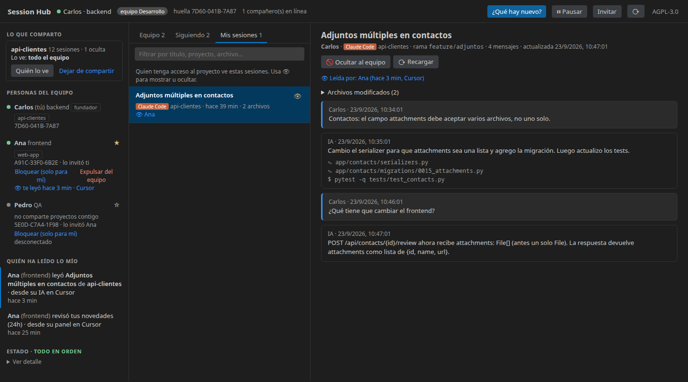
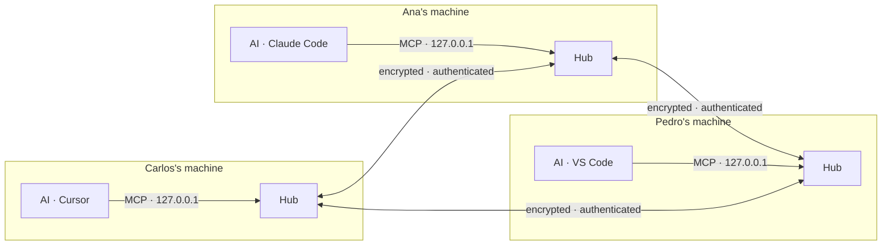

<div align="center">


# Session Hub

**See what your teammates did with their AI — and let your AI ask them.**
Share Claude Code and Cursor sessions across your team, message each other, and keep every session backed up even after the tool deletes it — peer‑to‑peer, end‑to‑end encrypted, with signed identities and an MCP server built in.

[](LICENSE)
[](https://github.com/carlosvisbal/session-hub/releases)
[](https://github.com/carlosvisbal/session-hub/actions/workflows/ci.yml)


**English** · [Español](README.es.md)



<sub>Demo data. Interface in English and Spanish.</sub>

</div>

---

## Why

Your backend teammate spent the morning with Claude Code changing an API. You, on the frontend, find out hours later — or never. **Session Hub** turns those AI conversations into shared, searchable team context:

> *"What did Carlos change in the backend today?"* — ask your own AI, get the answer from his real sessions.

### What it covers

| | |
|---|---|
| 👀 **See** | Every teammate's Claude Code and Cursor sessions (complete, grouped by project), who's online and which AI sessions they have open. |
| ✉️ **Talk** | Signed messages to a teammate or one of their sessions; they choose whether to pass them to their AI. **Automatic conversations**: with both people's consent, the two AIs talk on their own through Claude Code and Cursor hooks, up to a turn and time limit. |
| 🗄️ **Keep** | A local backup of your sessions (Claude Code deletes history after 30 days) and read copies of your team's, with delete and export. |
| 🤖 **Use** | Any session — live, backed up or copied — in your AI chat (Claude Code, Copilot, Cursor) with one click or through MCP. |

Always under your control: nothing is shared until you choose, it's read‑only, and there's no central server.

## Features

| | |
|---|---|
| 🤝 **Team view** | Everyone's Claude Code and Cursor sessions in one panel: who asked what, which files changed, where it ended up. |
| 🧠 **MCP built in** | Your AI (Cursor, VS Code agent mode, Claude Code) can list, search and read **complete** sessions from your teammates. |
| 🔐 **Signed identity** | Every install has an Ed25519 key. Nobody can impersonate anyone — not even with a stolen certificate. |
| 🛰️ **No central server** | Each person runs their own hub; hubs talk directly over Hyperswarm, encrypted with Noise. Works on a LAN with no internet. |
| 🎛️ **Personal control** | Choose which projects you share and with whom, hide single sessions, pause everything, block someone just for you. |
| ✉️ **Messages between people** | Write to a teammate — or to one of their open AI sessions — from the panel or by asking your AI. Signed, held until they approve it, and one click passes it to their AI. Nothing runs by itself. |
| 🗄️ **Local backup** | Your sessions stay available even after Claude Code (30 days) or Cursor delete them, and you can keep copies of your teammates' sessions to read offline — only while you still have access. Export to Markdown/JSON. |
| 👁️ **Transparency** | Get notified when someone reads your session — who, which one, which project, from which tool. 90‑day audit log. |
| 🧹 **Secret redaction** | Tokens, passwords, keys and credentialed URLs leave your machine as `[REDACTED]`. |
| 📜 **Free software** | AGPL‑3.0‑or‑later. The running hub serves its own source at `/source`. |

## Quick start

```bash
cursor --install-extension session-hub.vsix     # or: code --install-extension session-hub.vsix
```

Download `session-hub.vsix` from the [latest release](https://github.com/carlosvisbal/session-hub/releases/latest). No Node.js install needed — the hub runs on the editor's own runtime.

1. **Create a team** in the Session Hub sidebar (first person only).
2. **Invite** — copies a one‑time `SH2-…` code (valid 48 h). Any member can invite.
3. **Join** — paste the code. The inviter's hub confirms you automatically when both are online.
4. **Share a project** and pick who can see it.

📘 Full guide for non‑technical users: **[docs/MANUAL.md](docs/MANUAL.md)**

## How it works



- The API and MCP of each person listen **only on 127.0.0.1**; your AI talks only to your own hub.
- Each hub is its owner's **orchestrator**: it asks the other hubs in parallel, merges answers and labels whose they are. A slow teammate never blocks the rest (10 s timeout per call).
- Each hub answers **only for its owner, with its owner's rules**, and logs every read.
- Membership is a **certificate chain** rooted at the team founder: invite → member → admission. A leaked invite can't admit a second person.

| Network mode (`sessionHub.network`) | Use | Needs |
|---|---|---|
| `lan` *(default)* | Office network; the hubs themselves form the network | UDP `49737` allowed |
| `private` | Remote/VPN with your own bootstrap nodes | `sessionHub.bootstrap` |
| `public` | Remote with zero setup | Outbound UDP |

**Remote, step by step.** Your own infrastructure (bootstrap nodes + a blind relay that only forwards encrypted bytes) starts with one command:

```bash
npm run infra -- --host 203.0.113.10     # prints the settings every teammate pastes
npm run infra -- --public                # relay only, on the public network
```

VPNs (WireGuard, Tailscale, corporate) are detected and advertised automatically. If a connection fails because of a network policy (UDP blocked, strict NAT, unreachable relay…), Session Hub tells you **why** and **Copy connection report** produces a ready‑to‑send message for IT.

**Language:** the interface follows the editor language (Spanish or English); force it with `sessionHub.language`.

## MCP tools

| Tool | What it does |
|---|---|
| `list_peers` | Team members, who's online, what they share with you, network status |
| `what_changed` | What each teammate did since a date: requests, files, commands, final state |
| `list_sessions` | Sessions by person, project, source and date |
| `get_session` | A **complete** session — every message, untruncated |
| `search_sessions` | Full‑text search across what your team shares with you |
| `list_agents` | AI sessions each teammate has open right now (tool, project, busy/idle) |
| `send_message` | A signed text message to one teammate (queued up to 24 h if they're offline) |
| `check_inbox` | Messages you approved for your AI, marked as coming from a teammate, not from you |
| `start_conversation` / `end_conversation` | Propose (you confirm, they accept) and end an automatic conversation |

`list_sessions` accepts `origen: "respaldo"` to list only what comes from backups (originals already deleted) or local copies. Results carry `projectKey` (same repo = same key), `archived` and `copy`, so the AI never mixes projects and knows when it reads a copy.

**Use any session in any chat:** click **🤖 Use in my AI** on a session (also in the *Backup* tab) and the request to read it with `get_session` is typed into Claude Code, Copilot or Cursor — just add your question. Or ask directly: *"Read in Session Hub my backed‑up session about signatures and summarize what changed."*

All tools accept `peer` (name, fingerprint, `"me"` or `"all"`). Empty results explain *why* (nobody online vs. nothing shared).

## Command line (no editor)

```bash
npm install
npm run setup -- --name Ana --role frontend /path/to/project=my-api
npm run setup -- team create "dev-team"     # or: npm run setup -- team join SH2-…
npm start
npm test
```

## Security

Threat model and known limitations: **[SECURITY.md](SECURITY.md)**. Report vulnerabilities privately to **carlosvisbal66@gmail.com**.

## Contributing

Pull requests welcome under the [DCO](CONTRIBUTING.md) (`git commit -s`) — no copyright assignment. See [CHANGELOG.md](CHANGELOG.md).

## License

Session Hub is free software under the [GNU Affero General Public License v3.0 or later](LICENSE). © 2026 Carlos Visbal and the Session Hub authors ([AUTHORS](AUTHORS)).
If you modify it and let others use it over a network, you must offer them your source (AGPL §13) — the hub does this automatically at `/source`.

Not affiliated with Anysphere (Cursor) or Anthropic (Claude Code). See [NOTICE](NOTICE).
