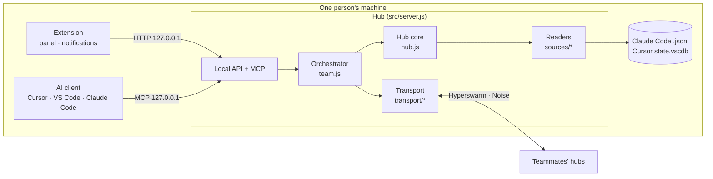

# Architecture

Technical reference for contributors. Users: see the [user guide](MANUAL.md).

## Overview

Every person runs a **hub**: a Node.js process started by the editor extension (on the editor's own runtime) or by `npm start`. There is no central server.



## Modules

| File | Responsibility |
| --- | --- |
| `src/sources/claude.js` | Reads `~/.claude/projects/<encoded path>/*.jsonl`; normalizes messages and actions; cache by mtime+size |
| `src/sources/cursor.js` | Reads Cursor's `state.vscdb` (read‑only SQLite via `node:sqlite`): `composerHeaders` + `cursorDiskKV` |
| `src/redact.js` | Pattern‑based secret redaction applied to everything that leaves the hub |
| `src/hub.js` | Owner's data: allowlisted projects, per‑viewer ACL, exclusions, pause, summaries, paging, search |
| `src/identity.js` | Pure crypto: Ed25519 keys, signed docs, certificate chain, profiles, revocations, invite codes |
| `src/teamstate.js` | Persistent team state (`team.json`, mode 0600) and admission rules |
| `src/transport/swarm.js` | Hyperswarm/HyperDHT connections, handshake, firewall, gossip, direct dialing, refresh |
| `src/transport/rpc.js` | Line‑delimited JSON RPC over the encrypted stream, with timeouts and size limits |
| `src/team.js` | Local orchestrator: fans out to teammates in parallel, merges and labels results |
| `src/access.js` | Audit log (`audit.jsonl`): reads, denials, rejected connections; retention |
| `src/mcp.js` | MCP tools (`list_peers`, `what_changed`, `list_sessions`, `get_session`, `search_sessions`) |
| `src/server.js` | Local HTTP API (127.0.0.1 only), MCP endpoint, hot config reload, shutdown |
| `src/source.js` | AGPL §13: serves the running source at `/source` |
| `src/netdiag.js` | Classifies connection failures (UDP blocked, strict NAT, hole‑punch failure, relay down, mode mismatch…) and builds the shareable report |
| `src/infra.js` | `npm run infra`: 3 bootstrap nodes + blind relay (`blind-relay`) with a stable key |
| `media/i18n.js`, `locales/en.json` | Spanish ↔ English translation shared by hub, extension and panel; templates with `{v1}` placeholders |
| `extension/*.cjs`, `media/*` | Editor integration: hub lifecycle (shared across windows), panel, notifications, MCP registration |

## Identity and membership

- Each install has an **Ed25519 key pair** (HyperDHT/sodium format). Identity = public key. Display name and role are a **profile** signed by that key.
- A team is identified by its **founder's public key**. Membership is a certificate chain rooted at the founder; each invitation adds three links:

| Link | Signed by | Body |
| --- | --- | --- |
| `invite` | an existing member (`issuer`) | `team`, `issuer`, one‑time `invite` public key, `expires` (48 h) |
| `member` | the one‑time invite key | `team`, `member` (joiner's public key), `via` (invite key) |
| `admit` | the invite's `issuer`, **once**, within validity | `team`, `invite`, `member` |

- **Admission** is what makes a leaked invite useless to a second person: only the issuer can admit, it records the redemption, and it checks expiry with its own clock.
- **Revocation** is valid when signed by an ancestor of the target in its chain (or the founder). Revoking someone also excludes everyone they invited.
- **Blocking** is local only (`teamState.setBlocked`); no one else is told.

Signatures cover canonical JSON (keys sorted at every level). Invite codes are `SH2-` + base64url(JSON).

## Wire protocol

Hubs join a topic `sha256("session-hub/v2/" + teamId)` and also dial known members directly (small teams can't rely on the DHT alone). The Noise handshake authenticates the remote static key; then each side sends:

```json
{ "t": "hello", "v": 2, "chain": [...], "profile": {...}, "addrs": ["10.0.0.5:49737"], "gossip": { "members": [...], "revocations": [...] } }
```

The receiver verifies the chain **and** that the chain's member key equals the connection's key. Failure → connection closed and key banned for 10 min (15 s if merely pending admission).

| Message | Direction | Purpose |
| --- | --- | --- |
| `hello` | both | certificate chain, signed profile, addresses, gossip |
| `admitted` | issuer → joiner | admission doc completing the joiner's chain |
| `req` / `res` | both | RPC: `whoami`, `projects`, `sessions`, `session`, `changes`, `search` |
| `revoke` | any → all | signed revocation, verified before applying |
| `profile` | any → all | updated signed name/role |

**Relay.** When hole‑punching fails (`HOLEPUNCH_*`, `CANNOT_HOLEPUNCH`, `REMOTE_NOT_HOLEPUNCHABLE`) and `relay` is configured, the connection is retried through a blind relay (`relayThrough`). The relay pairs two UDX streams and forwards encrypted bytes; the Noise session stays end‑to‑end between the two hubs.

Full sessions travel in pages (`offset`/`limit`, 100 messages) and are verified on reassembly: if the total doesn't match, the read fails instead of returning partial data.

## Timeouts and limits (nothing hangs)

| Where | Value |
| --- | --- |
| RPC call | 10 s |
| Handshake (`hello`) | 10 s |
| Network start | 15 s (continues in background) |
| Local HTTP request | 30 s (`server.requestTimeout`) |
| Frame size | 64 MB |
| Extension → hub call | 15 s (60 s for full session reads) |
| Health watchdog | alert after 3 failed checks (~30 s) |
| Discovery refresh / direct dial | 30 s / 15 s |

## Storage

| File | Content | Mode |
| --- | --- | --- |
| `config.json` | owner, port, local token, network, shared projects, exclusions, pause | 0600 |
| `team.json` | key pair, team, chain, members, admissions, revocations, blocks, addresses | 0600 |
| `audit.jsonl` | one line per read / denial / rejected connection | 0600 |

In the extension these live in the editor's `globalStorage` for the extension; all windows share them and a single hub.

## Security invariants

1. The local API and MCP bind to `127.0.0.1` only and require the local token.
2. A remote request is always evaluated with the **verified** peer key as viewer.
3. Everything leaving the hub goes through `redact()`.
4. Session sources are opened read‑only.
5. No operation waits without a deadline.

## Tests

- `npm test` — unit tests: identity and membership, readers (fixtures), redaction, hub permissions and paging, network diagnosis.
- `npm run test:e2e` — real hubs on this machine: LAN mode (admission, ACL, complete encrypted reads verified byte for byte) and private mode through your own bootstrap nodes and a forced blind relay, plus the network report for an unreachable bootstrap.
