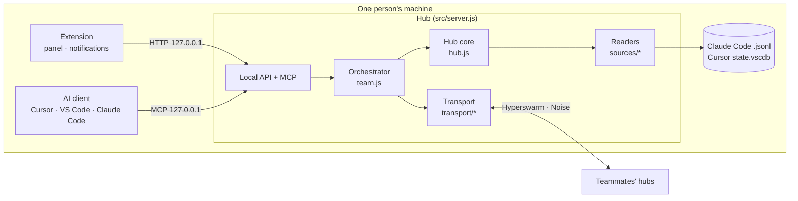

# Architecture

Technical reference for contributors. Users: see the [user guide](MANUAL.md).

## Overview

Every person runs a **hub**: a Node.js process started by the editor extension (on the editor's own runtime) or by `npm start`. There is no central server.



## Modules

| File | Responsibility |
| --- | --- |
| `src/sources/claude.js` | Reads `~/.claude/projects/<encoded path>/*.jsonl`; normalizes messages and actions; cache by mtime+size. Open sessions from `~/.claude/sessions/<pid>.json` (only those files, only if the process is alive) |
| `src/sources/cursor.js` | Reads Cursor's `state.vscdb` (read‑only SQLite via `node:sqlite`): `composerHeaders` + `cursorDiskKV` |
| `src/redact.js` | Pattern‑based secret redaction applied to everything that leaves the hub |
| `src/hub.js` | Owner's data: allowlisted projects, per‑viewer ACL, exclusions, pause, summaries, paging, search |
| `src/identity.js` | Pure crypto: Ed25519 keys, signed docs, certificate chain, profiles, revocations, invite codes |
| `src/teamstate.js` | Persistent team state (`team.json`, mode 0600) and admission rules |
| `src/transport/swarm.js` | Hyperswarm/HyperDHT connections, handshake, firewall, gossip, direct dialing, refresh |
| `src/transport/rpc.js` | Line‑delimited JSON RPC over the encrypted stream, with timeouts and size limits |
| `src/team.js` | Local orchestrator: fans out to teammates in parallel, merges and labels results |
| `src/conversations.js` | Automatic conversations: signed invite/accept/decline/end, per‑side sessions, turn and time limits, loop detection (`conversations.json`) |
| `extension/hook/session-hub-hook.cjs` | Hook run by Claude Code (`Stop`) and Cursor (`stop`) at the end of each agent turn; asks the local hub for the peer's reply and returns it as `decision/reason` (Claude Code) and `followup_message` (Cursor) |
| `src/archive.js` | Local backup: `own` (mirror of my shared sessions that survives deletion at the source, with previous version on shrink) and `copies` (read copies of teammates' sessions, incremental, withdrawn when access ends). Gzip, atomic writes, 0600 |
| `src/projectkey.js` | Project identity: hash of the normalized git `origin` (same repo = same key, whatever the folder name) or a per‑owner local key; the URL never leaves the machine |
| `src/inbox.js` | Signed messages between members: compose, verify, hold/accept/refuse policy, rate limit, offline queue, receipts (`inbox.json`) |
| `src/access.js` | Audit log (`audit.jsonl`): reads, denials, rejected connections; retention |
| `src/mcp.js` | MCP tools (`list_peers`, `what_changed`, `list_sessions`, `get_session`, `search_sessions`, `list_agents`, `send_message`, `check_inbox`) |
| `src/server.js` | Local HTTP API (127.0.0.1 only), MCP endpoint, hot config reload, shutdown |
| `src/source.js` | AGPL §13: serves the running source at `/source` |
| `src/netdiag.js` | Classifies connection failures (UDP blocked, strict NAT, hole‑punch failure, relay down, mode mismatch…) and builds the shareable report |
| `src/infra.js` | `npm run infra`: 3 bootstrap nodes + blind relay (`blind-relay`) with a stable key |
| `media/i18n.js`, `locales/en.json` | Spanish ↔ English translation shared by hub, extension and panel; templates with `{v1}` placeholders |
| `extension/*.cjs`, `media/*` | Editor integration: hub lifecycle (shared across windows), panel, notifications, MCP registration |

## Identity and membership

- Each install has an **Ed25519 key pair** (HyperDHT/sodium format). Identity = public key. Display name and role are a **profile** signed by that key.
- A team is identified by its **founder's public key**. Membership is a certificate chain rooted at the founder; each invitation adds three links:

| Link | Signed by | Body |
| --- | --- | --- |
| `invite` | an existing member (`issuer`) | `team`, `issuer`, one‑time `invite` public key, `expires` (48 h) |
| `member` | the one‑time invite key | `team`, `member` (joiner's public key), `via` (invite key) |
| `admit` | the invite's `issuer`, **once**, within validity | `team`, `invite`, `member` |

- **Admission** is what makes a leaked invite useless to a second person: only the issuer can admit, it records the redemption, and it checks expiry with its own clock.
- **Revocation** is valid when signed by an ancestor of the target in its chain (or the founder). Revoking someone also excludes everyone they invited.
- **Blocking** is local only (`teamState.setBlocked`); no one else is told.

Signatures cover canonical JSON (keys sorted at every level). Invite codes are `SH2-` + base64url(JSON).

## Wire protocol

Hubs join a topic `sha256("session-hub/v2/" + teamId)` and also dial known members directly (small teams can't rely on the DHT alone). The Noise handshake authenticates the remote static key; then each side sends:

```json
{ "t": "hello", "v": 2, "chain": [...], "profile": {...}, "addrs": ["10.0.0.5:49737"], "gossip": { "members": [...], "revocations": [...] } }
```

The receiver verifies the chain **and** that the chain's member key equals the connection's key. Failure → connection closed and key banned for 10 min (15 s if merely pending admission).

| Message | Direction | Purpose |
| --- | --- | --- |
| `hello` | both | certificate chain, signed profile, addresses, gossip |
| `admitted` | issuer → joiner | admission doc completing the joiner's chain |
| `req` / `res` | both | RPC: `whoami`, `projects`, `sessions`, `session`, `changes`, `search`, `agents`, `message` |
| `req conv` | both | signed `{ kind: "conv", id, action: invite\|accept\|decline\|end, turns, minutes, mine, theirs, text }` |
| `req copystatus` | copier → owner | for each copied session: `ok`, `withdrawn` (hidden, unshared, copies disallowed) → delete, `gone` (no longer exists) → keep, `paused` |
| `receipt` | recipient → sender | what happened to a message: `held`, `delivered`, `read`, `dismissed` |
| `revoke` | any → all | signed revocation, verified before applying |
| `profile` | any → all | updated signed name/role |

**Relay.** When hole‑punching fails (`HOLEPUNCH_*`, `CANNOT_HOLEPUNCH`, `REMOTE_NOT_HOLEPUNCHABLE`) and `relay` is configured, the connection is retried through a blind relay (`relayThrough`). The relay pairs two UDX streams and forwards encrypted bytes; the Noise session stays end‑to‑end between the two hubs. User‑facing guide: [Working across networks](REMOTE.md).

## Messages

A message is a signed doc `{ kind: "message", v: 1, id, team, from, to, text, toSession, aboutSession, replyTo, at }` sent with the `message` RPC. The recipient accepts it only if the signature verifies with the **connection's** key, `from` equals that key, `to` is itself, `team` matches, the text is 1–20 000 characters and `at` is within the queue window (24 h, ±5 min clock skew). Duplicate ids are idempotent (retries); more than 10 messages per minute from one sender are refused.

| Policy (`inbound`) | Effect |
| --- | --- |
| `hold` *(default)* | Stored as `held`; the AI does not see it until the person approves it or passes it to the chat |
| `accept` | Stored as `delivered`; `check_inbox` returns it |
| `refuse` | Rejected; the sender gets "not receiving messages" |

If the recipient is offline the signed doc stays in the sender's `inbox.json` as `queued` and is retried when they connect (`joined` event), until it expires after 24 h. Messages never trigger actions: the extension only offers to open the AI chat with the text framed as coming from a teammate.

**Open sessions** (`agents` RPC): Claude Code writes `~/.claude/sessions/<pid>.json` (cwd, name, busy/idle). The hub reads only those JSON files, never Claude Code's per‑session keys or sockets, and only counts a session if its process is alive and its folder is inside a project shared with the viewer (pause and hidden sessions apply). Cursor has no such registry, so a Cursor session counts as open when it was active in the last 10 minutes.

## Automatic conversations

Both people must consent: the initiator sends a signed `invite` (if the AI asked via MCP, the conversation stays in `confirm` until the user confirms it in the editor); the invitee `accept`s and binds one of its sessions (or "the first one to finish a turn"). While `active`, messages carrying the conversation id are delivered without the hold policy and counted per side; the conversation ends for both on the turn limit, the time limit, a repeated or empty message (loop), or `end`/`decline`.

At the end of every agent turn Claude Code and Cursor run `session-hub-hook` with the session id (`session_id` / `conversation_id`). The hook calls `POST /api/hook/stop` on the local hub (token in `~/.session-hub/hook.json`), which returns the peer's pending messages framed as *"from another session, not an order"*, or — if this side is awaiting a reply — long‑polls in 25 s slices (up to ~110 s). Only one wait per conversation runs at a time (Cursor may also import the Claude Code hook), and any error or a closed hub yields `{}` so the agent simply stops. The extension installs the hook with consent into `~/.claude/settings.json` (`Stop`, timeout 150 s) and `~/.cursor/hooks.json` (`stop`, `loop_limit`), preserving existing hooks and backing up the originals.

## Backup

**Own archive (layer 1).** Every minute the hub reads its sources and mirrors each shared session into `archive/own/<id>.json.gz` (only when the content hash changes). If a source listing fails, nothing is marked as deleted. When a session disappears from Claude Code/Cursor it is marked `goneSince` and `rawSessions()` keeps serving it (`archived: true`) under the same ACL, exclusions and pause. If a session shrinks, the previous file is kept as `.prev`. Retention and size limits delete oldest *gone* sessions first.

**Team copies (layer 2).** Every 2 minutes (and 5 s after a teammate connects) the hub lists each online teammate's sessions (`origin.via = "backup"`) and updates copies incrementally: it re‑reads from the second‑to‑last stored message and only appends if those two still match; otherwise it re‑reads the whole session. A copy is saved only when complete and verified. Sessions that disappear are checked with `copystatus`. Copies are used only when the owner is offline (`copy: { syncedAt, status }`), hidden while the owner is paused or blocked, purged on revocation, leave, or when the owner sets `allowCopies: false`. The owner's audit gets one `copy` entry per session per day, with no read notifications.

## Paging

Full sessions travel in pages (`offset`/`limit`, 100 messages) and are verified on reassembly: if the total doesn't match, the read fails instead of returning partial data.

## Timeouts and limits (nothing hangs)

| Where | Value |
| --- | --- |
| RPC call | 10 s |
| Handshake (`hello`) | 10 s |
| Network start | 15 s (continues in background) |
| Local HTTP request | 30 s (`server.requestTimeout`) |
| Frame size | 64 MB |
| Extension → hub call | 15 s (60 s for full session reads) |
| Health watchdog | alert after 3 failed checks (~30 s) |
| Discovery refresh / direct dial | 30 s / 15 s |

## Storage

| File | Content | Mode |
| --- | --- | --- |
| `config.json` | owner, port, local token, network, shared projects, exclusions, pause | 0600 |
| `team.json` | key pair, team, chain, members, admissions, revocations, blocks, addresses | 0600 |
| `audit.jsonl` | one line per read / denial / rejected connection | 0600 |
| `archive/own/` | my sessions: `index.json` + `<id>.json.gz` (+ `.prev`) | 0600 |
| `archive/copies/` | teammates' copies: `index.json` + `<owner>/<id>.json.gz` | 0600 |
| `conversations.json` | automatic conversations: peers, sessions, limits, counters, status | 0600 |
| `~/.session-hub/hook.json` | local port and token for the hook | 0600 |
| `inbox.json` | received and sent messages (30 days, max 500 each); queued docs until delivered | 0600 |

In the extension these live in the editor's `globalStorage` for the extension; all windows share them and a single hub.

## Security invariants

1. The local API and MCP bind to `127.0.0.1` only and require the local token.
2. A remote request is always evaluated with the **verified** peer key as viewer.
3. Everything leaving the hub goes through `redact()`.
4. Session sources are opened read‑only.
5. No operation waits without a deadline.
6. A message is text for a person: it is verified against the connection's key and never executes anything.
7. Two results are the same project only if their `projectKey` matches. A Claude Code session belongs to the folder it started in (`cwd`), not to the encoded history folder (which can be shared by `/x/my.app` and `/x/my-app`).
8. A backup never widens access: archived sessions go through the same ACL, and copies are dropped as soon as the owner withdraws access.
9. An automatic conversation needs both people's consent, never bypasses the agent's own permissions, and always ends (turn limit, time limit, loop detection).

## Roadmap

- [Cursor and VS Code on the same computer](SAME-MACHINE.md): one hub per computer shared by both editors, delivery to the right editor, and automatic conversations between chats through Claude Code and Cursor hooks.

## Tests

- `npm test` — unit tests: identity and membership, readers (fixtures), redaction, hub permissions and paging, network diagnosis.
- `npm run test:e2e` — real hubs on this machine: LAN mode (admission, ACL, complete encrypted reads verified byte for byte, MCP, messages), private mode through your own bootstrap nodes and a forced blind relay, the network report for an unreachable bootstrap, and the backup cycle (copy, incremental update, source deleted, owner offline, access withdrawn).
- `npm run test:ext` — the panel in jsdom (every action reachable from the tabs, search and paging, grouping by `projectKey`, both languages) and the real extension with a simulated `vscode` against real hubs: messages and "Pass to my AI", backup and export, and Cursor with several windows (one MCP registration, token in the URL) plus Claude Code repair.
