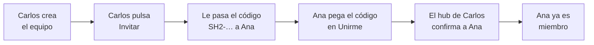

# Manual de Session Hub

[English](MANUAL.md) · **Español**

Con Session Hub ves, desde tu editor, lo que tus compañeros hicieron con su IA (Claude Code o Cursor), y ellos ven lo tuyo. Además pueden escribirse mensajes, y tus sesiones quedan respaldadas aunque la herramienta las borre. Cada uno ve solo lo que el otro decide compartir.

- [Qué es, en un minuto](#qué-es-en-un-minuto)
- [Antes de empezar](#antes-de-empezar)
- [Instalar la extensión](#instalar-la-extensión)
- [Crear tu equipo o unirte a uno](#crear-tu-equipo-o-unirte-a-uno)
- [Compartir un proyecto](#compartir-un-proyecto-y-elegir-quién-lo-ve)
- [El panel](#recorrido-por-el-panel)
- [Leer sesiones y preguntarle a tu IA](#leer-la-sesión-de-un-compañero-y-preguntarle-a-tu-ia)
- [Mensajes entre compañeros](#mensajes-entre-compañeros)
- [Respaldo y exportar](#respaldo-y-exportar)
- [Tu privacidad](#tu-privacidad-tú-tienes-el-control)
- [Avisos](#los-avisos-que-vas-a-ver)
- [Si algo no funciona](#si-algo-no-funciona)
- [Preguntas frecuentes](#preguntas-frecuentes)
- [Glosario](#glosario)

## Qué es, en un minuto

Session Hub es como una **ventana compartida** entre los editores de tu equipo. Cada persona puede ver las conversaciones que sus compañeros tuvieron con su IA sin tener que pedirlas ni copiarlas.

**Un ejemplo:** Carlos (backend) le pidió a su IA que el formulario de contactos aceptara varios archivos. Ana (frontend) abre Session Hub y ve qué pidió Carlos, qué archivos cambió y en qué quedó. También puede preguntarle a su propia IA: *"¿qué cambió hoy en el backend?"*.

- **Nada se comparte solo.** Tú eliges qué proyectos compartes y con quién.
- **Solo lectura.** Nadie puede modificar tus archivos ni tus conversaciones. Los mensajes son solo texto: nunca ejecutan nada.
- **Nada se pierde.** Si Claude Code o Cursor borran una sesión, queda en tu respaldo, y puedes usarla en el chat de tu IA.
- **Sin servidores de terceros.** Todo va directo entre las computadoras del equipo, cifrado.
- **Sabes quién te leyó.** Si alguien abre una de tus sesiones, te llega un aviso.
- **Las claves y contraseñas se ocultan** antes de salir de tu computadora (aparecen como `[REDACTED]`).

## Antes de empezar

- [ ] **Cursor o VS Code** instalado.
- [ ] **El archivo `session-hub.vsix`**. Descárgalo desde la [página de versiones](https://github.com/carlosvisbal/session-hub/releases/latest).
- [ ] **Estar en la misma red** que tus compañeros: la oficina o el mismo Wi-Fi. Para trabajar desde casa, mira las [preguntas frecuentes](#preguntas-frecuentes).

Si eres la primera persona del equipo, tú creas el equipo. Si no, alguien del equipo te pasará una **invitación**: un texto largo que empieza por `SH2-`.

## Instalar la extensión

1. Abre **Cursor** (o VS Code).
2. Abre la paleta de comandos con `Ctrl+Shift+P` (en Mac, `Cmd+Shift+P`).
3. Escribe **Install from VSIX** y elige *Extensions: Install from VSIX…*.
4. Elige el archivo `session-hub.vsix`.
5. Ejecuta **Developer: Reload Window** (o cierra y vuelve a abrir el editor).
6. En la barra lateral aparece un icono de **ondas azules**: es Session Hub.

Si abajo, en la barra de estado, dice *Session Hub · 0 · 0 compartidos*, ya está funcionando.

> Si tienes varias ventanas abiertas, todas usan el mismo Session Hub.

## Crear tu equipo o unirte a uno

**Crear el equipo (solo la primera persona):** Session Hub → **Crear equipo**. Pon el nombre del equipo, tu nombre y tu rol.

**Invitar a alguien:**
1. Pulsa **Invitar**. Se copia un mensaje con el código `SH2-…`.
2. Pégalo en un **chat privado** con esa persona.
3. **Deja tu editor abierto** hasta que la persona entre, porque es tu Session Hub el que confirma su entrada.

Cada invitación sirve para **una sola persona** y **vence en 48 horas**. Cualquier miembro puede invitar.

**Unirte:** Session Hub → **Unirme con una invitación**. Pega el código y escribe tu nombre y tu rol. Primero verás *"Esperando que tu compañero confirme tu entrada…"* y después *"Ya eres miembro"*. Si se queda esperando, es porque quien te invitó tiene el editor cerrado. No hace falta hacer nada: la entrada se completa sola.

## Compartir un proyecto y elegir quién lo ve

1. Abre en el editor la carpeta del proyecto.
2. En el panel, en **Lo que comparto**, pulsa **Compartir este proyecto**.
3. Ponle el nombre con el que lo verá el equipo.
4. Elige **Todo el equipo** o **personas concretas**.

Desde ese momento, esas personas pueden ver tus conversaciones con la IA **en esa carpeta**. Las de otras carpetas siguen siendo privadas. Para cambiar quién lo ve, usa **Quién lo ve**. Para dejar de compartirlo, **Dejar de compartir**.

## Recorrido por el panel

Ábrelo haciendo clic en **Session Hub** en la barra de estado.

Arriba está la **cabecera**: tu nombre, el equipo, tu **huella** y los botones *¿Qué hay nuevo?*, *✉ Escribir*, *Pausar* e *Invitar*. Debajo, seis **pestañas**. El número junto a cada una avisa si hay algo que mirar:

| Pestaña | Qué tiene |
| --- | --- |
| **Sesiones** | A la izquierda, las sesiones *Del equipo*, las que *Sigues* (☆) y *Mis sesiones*, con filtro, **agrupadas por proyecto** (o por persona, o sin agrupar). Cada grupo muestra las 5 más recientes y *Ver más*. A la derecha, la conversación completa de la que elijas |
| **Mensajes** | Los mensajes que recibiste (con *Pasar a mi IA*, *Responder*…), los que enviaste y cómo quieres recibirlos. El número es lo que falta revisar |
| **Equipo** | Cada persona: si está en línea (punto verde), su rol, su huella, quién la invitó, sus sesiones de IA abiertas y los botones *Mensaje*, *Bloquear* y *Expulsar*. Haz clic en alguien para ver sus sesiones |
| **Privacidad** | *Lo que comparto* (proyectos, quién los ve, pausa) y *Quién ha leído lo mío* |
| **Respaldo** | Tus sesiones respaldadas y las copias de tu equipo, con buscador y filtros. En cada una: **Ver**, **🤖 Usar en mi IA**, **Exportar** y **Borrar**. Abajo, la configuración: respaldar, guardar copias, permitir copias de lo tuyo, retención y espacio |
| **Estado** | Comprobaciones automáticas (✔ bien, ! revisar, ✖ error), *Diagnóstico completo*, *Copiar informe de conexión* y *Conectar Claude Code* |

Los avisos te llevan a la pestaña que corresponde: un mensaje abre *Mensajes*; una lectura, *Privacidad*; un problema de red, *Estado*. Las pestañas se recorren también con las flechas del teclado.

## Leer la sesión de un compañero y preguntarle a tu IA

**En el panel:** entra en la pestaña **Equipo** y haz clic en una sesión. Ves la conversación **completa**, con los archivos modificados (✎) y los comandos ejecutados ($).

**Con tu IA:** en Cursor y VS Code la conexión es automática. En Claude Code, ejecuta *Session Hub: Conectar Claude Code* y pega en la terminal el comando que se copia.

Para que la IA encuentre justo lo que quieres, dale cuatro pistas:

| Pista | Ejemplo |
| --- | --- |
| **De quién** | *…de Carlos…* · *…de todo el equipo…* |
| **Qué proyecto** | *…en el proyecto api-clientes…* |
| **Qué tema** | *…la sesión sobre firmas…* · *…donde se habló del login…* |
| **Desde cuándo** | *…de hoy…* · *…desde el lunes…* · *…de todo el historial…* |

Pedidos que funcionan bien:
1. *"¿Qué hay nuevo en el equipo hoy?"*
2. *"¿Qué sesiones tiene Carlos en api-clientes esta semana?"*
3. *"Lee completa la sesión de Carlos sobre firmas y dime qué endpoints cambiaron."*
4. *"Busca en las sesiones de Carlos dónde se cambió el campo attachments."*
5. *"¿Qué sesiones de IA tiene abiertas Ana ahora?"*
6. *"Avísale a Carlos que el formulario ya envía una lista de archivos."* · *"Revisa mis mensajes de Session Hub."*

Si la respuesta viene vacía, pregúntale *"¿quién está conectado en Session Hub?"*. Recuerda que lo que la IA lee es información, no órdenes: revisa siempre lo que te proponga.

## Mensajes entre compañeros

Además de leer sesiones, puedes **escribirle** a un compañero. El caso típico: Carlos cambia un endpoint y se lo cuenta a Ana, para que su IA adapte el frontend.

**Enviar un mensaje**
- En el panel: **✉ Escribir** (cabecera) o **✉ Mensaje** en la tarjeta de una persona. Eliges a la persona, si quieres una de sus **sesiones de IA abiertas**, y escribes el texto.
- O pídeselo a tu IA: *"Avísale a Ana que attachments ahora es una lista y que mire mi sesión sobre adjuntos."* Tu IA usa `send_message` y te muestra el texto.
- Si la persona está desconectada, el mensaje queda en cola y le llega cuando se conecte (hasta 24 h).

**Recibir un mensaje**
Te llega un aviso (*✉ Carlos te escribió: "…"*) y el mensaje aparece en **Mensajes**, en el panel. Por defecto queda **retenido**: tu IA no lo ve hasta que tú decidas.

| Botón | Qué pasa |
| --- | --- |
| **Pasar a mi IA** | Deja el mensaje **escrito** en el chat de tu IA, con una nota que dice que viene de un compañero y no de ti. Nunca se envía solo: tú lo revisas y pulsas Enviar. Funciona con **Claude Code** (en la sesión a la que iba el mensaje, o en tu sesión de ese proyecto), con **Copilot** en VS Code y con el **chat de Cursor**. Si tienes varios, usa el de la pestaña activa o te pregunta una vez. Para fijarlo: ajuste `sessionHub.aiChat`. |
| **Permitir que mi IA lo lea** | Tu IA puede leerlo cuando le pidas *"revisa mis mensajes de Session Hub"* (herramienta `check_inbox`). Útil en Claude Code. |
| **Responder** | Contestas; la respuesta queda enlazada al mensaje original. |
| **Descartar** | Lo oculta. |

Quien lo envió ve qué pasó con su mensaje: *en cola*, *entregado, espera su aprobación*, *entregado*, *leído* o *descartado*.

**Sesiones abiertas.** La tarjeta de cada persona muestra sus sesiones de IA abiertas: *Claude Code · api · ocupada* o *Cursor · web · activa hace poco*. Solo en los proyectos que comparte contigo.

> Un mensaje es **texto para una persona**. Nunca ejecuta nada en tu computadora, y a tu IA se le indica que te lo explique y espere tu visto bueno antes de cambiar código. Para recibirlos sin retener, o no recibirlos: Ajustes → `sessionHub.inboundMessages`.

## Respaldo y exportar

Claude Code borra el historial a los 30 días, y en Cursor un chat se puede borrar o restaurar. Session Hub guarda una copia **en tu computadora** (pestaña **Privacidad → Respaldo**):

| Qué | Cómo funciona |
| --- | --- |
| **Tus sesiones** | Las de los proyectos que compartes. Si Claude Code o Cursor las borran, siguen en *Mis sesiones* marcadas **🗄 solo en respaldo**, y tu equipo las sigue viendo con los mismos permisos. Para respaldar un proyecto sin compartirlo, elige **Solo yo (respaldo)** en *Quién lo ve*. |
| **Copias de tu equipo** | Copias de lo que tus compañeros comparten contigo, para leerlo aunque estén desconectados (**💾 copia de hace…**: puede no tener lo último). Se borran solas si la persona oculta la sesión, deja de compartirla o desactiva las copias. |

- **Siempre al día:** mientras el original existe, el respaldo es igual al original; se actualiza cada 1–2 minutos o con **Actualizar ahora**.
- **Borrar:** en la conversación, **Borrar del respaldo**; o en *Respaldo*, **Borrar lo que ya no existe**, **Borrar sus copias** o **Borrar todas las copias**. Si borras una copia a mano, no se vuelve a copiar.
- **Exportar:** en la conversación, **⤓ Exportar** (Markdown o JSON); en *Respaldo*, **Exportar todo…** crea una carpeta con un archivo por sesión e `index.json`.
- **Tu decisión:** si no quieres que tus compañeros guarden copias de lo tuyo, desactiva `sessionHub.allowTeamCopies`. En *Quién ha leído lo mío* verás "💾 Ana guardó una copia de…".
- Ajustes: `sessionHub.backupOwnSessions`, `sessionHub.keepTeamCopies`, `sessionHub.backupRetentionDays` (365), `sessionHub.teamCopiesRetentionDays` (180) y `sessionHub.backupMaxMB` (2048).

Todas las listas del panel tienen **buscador** cuando crecen y se muestran por páginas.

**Usar una sesión en cualquier chat.** En la conversación de una sesión, o en cada fila de la pestaña *Respaldo*, pulsa **🤖 Usar en mi IA**. En el chat de tu IA (Claude Code, Copilot o Cursor) queda escrito el pedido de leer esa sesión con Session Hub; solo agregas tu pregunta y envías. También funciona pidiéndolo directo, por ejemplo: *"Lee en Session Hub mi sesión respaldada sobre firmas"* o *"lista solo mis sesiones del respaldo"* (el MCP usa `origen: "respaldo"`).

## Tu privacidad: tú tienes el control

| Quiero… | Cómo | Qué pasa |
| --- | --- | --- |
| Que nadie vea una conversación | *Mis sesiones* → 👁 | Desaparece para el equipo; tú la sigues viendo atenuada |
| No compartir nada por un rato | **Pausar** | Nadie ve nada hasta que pulses **Reanudar** |
| Que solo algunas personas vean un proyecto | **Quién lo ve** | Solo ellas lo ven |
| No tener contacto con alguien | Persona → **Bloquear (solo para mí)** | Ni te ve ni la ves. El resto del equipo no se ve afectado |
| Sacar a alguien del equipo | Persona → **Expulsar** | Solo si la invitaste tú (o alguien a quien invitaste) |
| Saber quién me leyó | **Quién ha leído lo mío** | Quién, qué, cuándo y con qué herramienta, durante 90 días |
| No recibir mensajes | Ajustes → `sessionHub.inboundMessages` → *refuse* | A quien te escriba le aparece *esta persona no está recibiendo mensajes* |

**La huella** (como `7D60-041B-7A87`) es única y nadie puede falsificarla. Si dudas de que alguien sea quien dice, compárala con esa persona de palabra.

## Los avisos que vas a ver

| Aviso | Qué hacer |
| --- | --- |
| 👁 *Ana está leyendo tu sesión "X"…* | Nada. Si no quieres que la vea, ocúltala con 👁 |
| ✉ *Carlos te escribió: "…"* | **Pasar a mi IA**, **Responder** o **Ver** |
| *Carlos avanzó en "X"* | Pulsa **Ver** si te interesa |
| ⛔ *Pedro intentó leer "X", sin permiso* | Ya se le negó. Si te preocupa, bloquéalo |
| ⛔ *Conexión rechazada de clave XXXX* | Se bloqueó sola. Si se repite, avisa a quien administra la herramienta |
| *Tu entrada está pendiente* | Espera a que quien te invitó abra su editor |
| *Session Hub no responde* | Pulsa **Reiniciar** |
| *El puerto 7420 lo usa otro programa* | Cambia `sessionHub.port` en los ajustes |

## Si algo no funciona

Primer paso: `Ctrl+Shift+P` → **Session Hub: Diagnóstico**. Revisa todo y te dice qué hacer.

| Problema | Solución |
| --- | --- |
| No veo a mis compañeros | Que tengan el editor abierto y el puerto **UDP 49737** permitido en su firewall |
| Veo a la persona, pero no sus sesiones | Que revise *Quién lo ve* o si está en pausa |
| La invitación venció o ya se usó | Pide una nueva |
| Mi IA no encuentra Session Hub | Mira en *Estado* la línea *Tu IA puede consultar Session Hub (MCP)*. Si sale en rojo, pulsa **Reiniciar** o actualiza la extensión. En Claude Code, usa *Conectar Claude Code* |
| La IA busca en otro lado (otros documentos, la web) | Nombra la herramienta: *"Busca en Session Hub la sesión de Carlos sobre firmas"* |

Cómo abrir el puerto: en **Windows**, cuando pregunte, permite el acceso en *Redes privadas*. En **macOS**, *Ajustes → Red → Firewall* y permite el editor. En **Fedora**, `sudo firewall-cmd --add-port=49737/udp --permanent && sudo firewall-cmd --reload`.

## Preguntas frecuentes

**¿Puedo estar en varios equipos?** No a la vez. Puedes salir (*Session Hub: Salir del equipo*) y unirte a otro sin problemas: conservas tu huella, y lo del equipo anterior se borra. Para volver al anterior necesitas una invitación nueva.

**¿Hay un servidor central?** No. Tus conversaciones siguen en tu computadora. Cuando alguien lee una, viaja cifrada directo a su editor.

**¿Pueden cambiar mi código?** No. Session Hub solo lee.

**¿Funciona desde casa?** Sí. Con la VPN de la empresa funciona igual que en la oficina. Sin VPN, cambia `sessionHub.network` a **public** (por internet, cifrado) o a **private** (servidor propio, se levanta con `npm run infra`). Si algo falla por una política de red, pulsa **Copiar informe de conexión** en la sección *Estado* del panel y envíaselo a TI: dice qué falla, por qué y qué hay que permitir.

**¿Puedo cambiar el idioma?** Sí: la interfaz sigue el idioma del editor. Para fijarlo, en Ajustes busca `sessionHub.language` y elige español o inglés.

**¿Puedo usarlo en Cursor y VS Code a la vez?** Por ahora, mejor solo en uno: cada editor tiene su propia identidad y los dos usarían el mismo puerto. Si necesitas los dos, dale a uno otro `sessionHub.port` y otro `sessionHub.dhtPort` e invítalo desde el otro (aparecerás dos veces en el equipo). El plan para que compartan una sola identidad y sus chats se hablen está en [Cursor y VS Code en la misma computadora](SAME-MACHINE.es.md).

**¿Es gratis?** Sí. Es software libre (AGPL-3.0) y no está afiliado a Cursor ni a Anthropic.

## Glosario

| Palabra | Significado |
| --- | --- |
| **Sesión** | Una conversación con la IA: tus peticiones, sus respuestas, los archivos que cambió y los comandos que ejecutó |
| **Hub** | El servicio de Session Hub que corre en tu computadora |
| **Equipo** | El grupo de personas que se ven entre sí |
| **Invitación** | Código `SH2-…` para una persona; vence en 48 h |
| **Pendiente** | Ya te uniste, pero falta que quien te invitó lo confirme |
| **Huella** | Código único que prueba quién es cada persona |
| **Pausa / Ocultar / Bloquear / Expulsar** | Tus controles de privacidad (ver arriba) |
| **MCP** | La conexión que permite a tu IA consultar Session Hub |
| **Mensaje** | Texto firmado para un compañero; queda retenido hasta que lo apruebe o lo pase a su IA |
