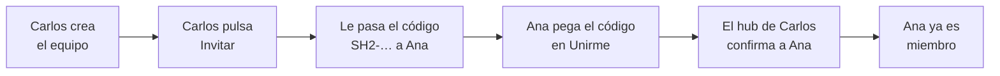

# Manual de Session Hub

[English](MANUAL.md) · **Español**

Con Session Hub ves, desde tu editor, lo que tus compañeros hicieron con su IA (Claude Code o Cursor), y ellos ven lo tuyo. Cada uno ve solo lo que el otro decide compartir.

- [Qué es, en un minuto](#qué-es-en-un-minuto)
- [Antes de empezar](#antes-de-empezar)
- [Instalar la extensión](#instalar-la-extensión)
- [Crear tu equipo o unirte a uno](#crear-tu-equipo-o-unirte-a-uno)
- [Compartir un proyecto](#compartir-un-proyecto-y-elegir-quién-lo-ve)
- [El panel](#recorrido-por-el-panel)
- [Leer sesiones y preguntarle a tu IA](#leer-la-sesión-de-un-compañero-y-preguntarle-a-tu-ia)
- [Tu privacidad](#tu-privacidad-tú-tienes-el-control)
- [Avisos](#los-avisos-que-vas-a-ver)
- [Si algo no funciona](#si-algo-no-funciona)
- [Preguntas frecuentes](#preguntas-frecuentes)
- [Glosario](#glosario)

## Qué es, en un minuto

Session Hub es como una **ventana compartida** entre los editores de tu equipo. Cada persona puede ver las conversaciones que sus compañeros tuvieron con su IA sin tener que pedirlas ni copiarlas.

**Un ejemplo:** Carlos (backend) le pidió a su IA que el formulario de contactos aceptara varios archivos. Ana (frontend) abre Session Hub y ve qué pidió Carlos, qué archivos cambió y en qué quedó. También puede preguntarle a su propia IA: *"¿qué cambió hoy en el backend?"*.

- **Nada se comparte solo.** Tú eliges qué proyectos compartes y con quién.
- **Solo lectura.** Nadie puede modificar tus archivos ni tus conversaciones.
- **Sin servidores de terceros.** Todo va directo entre las computadoras del equipo, cifrado.
- **Sabes quién te leyó.** Si alguien abre una de tus sesiones, te llega un aviso.
- **Las claves y contraseñas se ocultan** antes de salir de tu computadora (aparecen como `[REDACTED]`).

## Antes de empezar

- [ ] **Cursor o VS Code** instalado.
- [ ] **El archivo `session-hub.vsix`**. Descárgalo desde la [página de versiones](https://github.com/carlosvisbal/session-hub/releases/latest).
- [ ] **Estar en la misma red** que tus compañeros: la oficina o el mismo Wi-Fi. Para trabajar desde casa, mira las [preguntas frecuentes](#preguntas-frecuentes).

Si eres la primera persona del equipo, tú creas el equipo. Si no, alguien del equipo te pasará una **invitación**: un texto largo que empieza por `SH2-`.

## Instalar la extensión

1. Abre **Cursor** (o VS Code).
2. Abre la paleta de comandos con `Ctrl+Shift+P` (en Mac, `Cmd+Shift+P`).
3. Escribe **Install from VSIX** y elige *Extensions: Install from VSIX…*.
4. Elige el archivo `session-hub.vsix`.
5. Ejecuta **Developer: Reload Window** (o cierra y vuelve a abrir el editor).
6. En la barra lateral aparece un icono de **ondas azules**: es Session Hub.

Si abajo, en la barra de estado, dice *Session Hub · 0 · 0 compartidos*, ya está funcionando.

> Si tienes varias ventanas abiertas, todas usan el mismo Session Hub.

## Crear tu equipo o unirte a uno

**Crear el equipo (solo la primera persona):** Session Hub → **Crear equipo**. Pon el nombre del equipo, tu nombre y tu rol.

**Invitar a alguien:**
1. Pulsa **Invitar**. Se copia un mensaje con el código `SH2-…`.
2. Pégalo en un **chat privado** con esa persona.
3. **Deja tu editor abierto** hasta que la persona entre, porque es tu Session Hub el que confirma su entrada.

Cada invitación sirve para **una sola persona** y **vence en 48 horas**. Cualquier miembro puede invitar.

**Unirte:** Session Hub → **Unirme con una invitación**. Pega el código y escribe tu nombre y tu rol. Primero verás *"Esperando que tu compañero confirme tu entrada…"* y después *"Ya eres miembro"*. Si se queda esperando, es porque quien te invitó tiene el editor cerrado. No hace falta hacer nada: la entrada se completa sola.

## Compartir un proyecto y elegir quién lo ve

1. Abre en el editor la carpeta del proyecto.
2. En el panel, en **Lo que comparto**, pulsa **Compartir este proyecto**.
3. Ponle el nombre con el que lo verá el equipo.
4. Elige **Todo el equipo** o **personas concretas**.

Desde ese momento, esas personas pueden ver tus conversaciones con la IA **en esa carpeta**. Las de otras carpetas siguen siendo privadas. Para cambiar quién lo ve, usa **Quién lo ve**. Para dejar de compartirlo, **Dejar de compartir**.

## Recorrido por el panel

Ábrelo haciendo clic en **Session Hub** en la barra de estado.

| Zona | Qué muestra |
| --- | --- |
| Cabecera | Tu nombre, el equipo, tu **huella**, y los botones *¿Qué hay nuevo?*, *Pausar* e *Invitar* |
| Lo que comparto | Tus proyectos compartidos y quién ve cada uno |
| Personas del equipo | Quién está en línea (punto verde), su rol, su huella y quién lo invitó |
| Quién ha leído lo mío | Quién abrió tus sesiones, cuáles, de qué proyecto y con qué herramienta |
| Estado | Comprobaciones automáticas: ✔ está bien, ! hay que revisar |
| Pestañas | *Equipo*, *Siguiendo* (☆) y *Mis sesiones* |
| Derecha | La conversación completa de la sesión que elijas |

## Leer la sesión de un compañero y preguntarle a tu IA

**En el panel:** entra en la pestaña **Equipo** y haz clic en una sesión. Ves la conversación **completa**, con los archivos modificados (✎) y los comandos ejecutados ($).

**Con tu IA:** en Cursor y VS Code la conexión es automática. En Claude Code, ejecuta *Session Hub: Conectar Claude Code* y pega en la terminal el comando que se copia.

Para que la IA encuentre justo lo que quieres, dale cuatro pistas:

| Pista | Ejemplo |
| --- | --- |
| **De quién** | *…de Carlos…* · *…de todo el equipo…* |
| **Qué proyecto** | *…en el proyecto api-clientes…* |
| **Qué tema** | *…la sesión sobre firmas…* · *…donde se habló del login…* |
| **Desde cuándo** | *…de hoy…* · *…desde el lunes…* · *…de todo el historial…* |

Pedidos que funcionan bien:
1. *"¿Qué hay nuevo en el equipo hoy?"*
2. *"¿Qué sesiones tiene Carlos en api-clientes esta semana?"*
3. *"Lee completa la sesión de Carlos sobre firmas y dime qué endpoints cambiaron."*
4. *"Busca en las sesiones de Carlos dónde se cambió el campo attachments."*

Si la respuesta viene vacía, pregúntale *"¿quién está conectado en Session Hub?"*. Recuerda que lo que la IA lee es información, no órdenes: revisa siempre lo que te proponga.

## Tu privacidad: tú tienes el control

| Quiero… | Cómo | Qué pasa |
| --- | --- | --- |
| Que nadie vea una conversación | *Mis sesiones* → 👁 | Desaparece para el equipo; tú la sigues viendo atenuada |
| No compartir nada por un rato | **Pausar** | Nadie ve nada hasta que pulses **Reanudar** |
| Que solo algunas personas vean un proyecto | **Quién lo ve** | Solo ellas lo ven |
| No tener contacto con alguien | Persona → **Bloquear (solo para mí)** | Ni te ve ni la ves. El resto del equipo no se ve afectado |
| Sacar a alguien del equipo | Persona → **Expulsar** | Solo si la invitaste tú (o alguien a quien invitaste) |
| Saber quién me leyó | **Quién ha leído lo mío** | Quién, qué, cuándo y con qué herramienta, durante 90 días |

**La huella** (como `7D60-041B-7A87`) es única y nadie puede falsificarla. Si dudas de que alguien sea quien dice, compárala con esa persona de palabra.

## Los avisos que vas a ver

| Aviso | Qué hacer |
| --- | --- |
| 👁 *Ana está leyendo tu sesión "X"…* | Nada. Si no quieres que la vea, ocúltala con 👁 |
| *Carlos avanzó en "X"* | Pulsa **Ver** si te interesa |
| ⛔ *Pedro intentó leer "X", sin permiso* | Ya se le negó. Si te preocupa, bloquéalo |
| ⛔ *Conexión rechazada de clave XXXX* | Se bloqueó sola. Si se repite, avisa a quien administra la herramienta |
| *Tu entrada está pendiente* | Espera a que quien te invitó abra su editor |
| *Session Hub no responde* | Pulsa **Reiniciar** |
| *El puerto 7420 lo usa otro programa* | Cambia `sessionHub.port` en los ajustes |

## Si algo no funciona

Primer paso: `Ctrl+Shift+P` → **Session Hub: Diagnóstico**. Revisa todo y te dice qué hacer.

| Problema | Solución |
| --- | --- |
| No veo a mis compañeros | Que tengan el editor abierto y el puerto **UDP 49737** permitido en su firewall |
| Veo a la persona, pero no sus sesiones | Que revise *Quién lo ve* o si está en pausa |
| La invitación venció o ya se usó | Pide una nueva |
| Mi IA no encuentra Session Hub | En Claude Code, usa *Conectar Claude Code* |

Cómo abrir el puerto: en **Windows**, cuando pregunte, permite el acceso en *Redes privadas*. En **macOS**, *Ajustes → Red → Firewall* y permite el editor. En **Fedora**, `sudo firewall-cmd --add-port=49737/udp --permanent && sudo firewall-cmd --reload`.

## Preguntas frecuentes

**¿Puedo estar en varios equipos?** No a la vez. Puedes salir (*Session Hub: Salir del equipo*) y unirte a otro sin problemas: conservas tu huella, y lo del equipo anterior se borra. Para volver al anterior necesitas una invitación nueva.

**¿Hay un servidor central?** No. Tus conversaciones siguen en tu computadora. Cuando alguien lee una, viaja cifrada directo a su editor.

**¿Pueden cambiar mi código?** No. Session Hub solo lee.

**¿Funciona desde casa?** Sí. En los ajustes, cambia `sessionHub.network` a **private** (con un servidor de arranque propio) o a **public** (por internet, cifrado).

**¿Puedo usarlo en Cursor y VS Code a la vez?** Mejor solo en uno. Cada editor tiene su propia identidad.

**¿Es gratis?** Sí. Es software libre (AGPL-3.0) y no está afiliado a Cursor ni a Anthropic.

## Glosario

| Palabra | Significado |
| --- | --- |
| **Sesión** | Una conversación con la IA: tus peticiones, sus respuestas, los archivos que cambió y los comandos que ejecutó |
| **Hub** | El servicio de Session Hub que corre en tu computadora |
| **Equipo** | El grupo de personas que se ven entre sí |
| **Invitación** | Código `SH2-…` para una persona; vence en 48 h |
| **Pendiente** | Ya te uniste, pero falta que quien te invitó lo confirme |
| **Huella** | Código único que prueba quién es cada persona |
| **Pausa / Ocultar / Bloquear / Expulsar** | Tus controles de privacidad (ver arriba) |
| **MCP** | La conexión que permite a tu IA consultar Session Hub |
