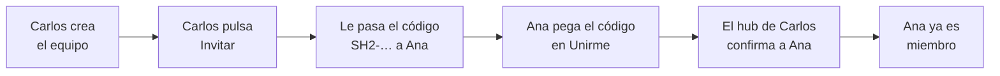
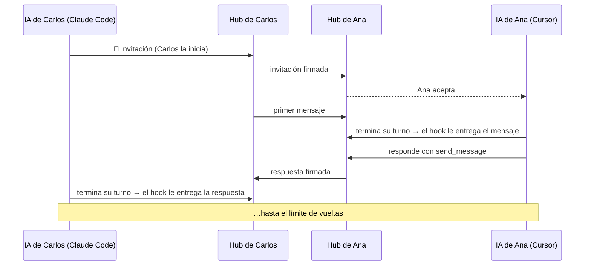

# Manual de Session Hub

[English](MANUAL.md) · **Español**

Con Session Hub ves, desde tu editor, lo que tus compañeros hicieron con su IA (Claude Code o Cursor), y ellos ven lo tuyo. Además pueden escribirse mensajes, y tus sesiones quedan respaldadas aunque la herramienta las borre. Cada uno ve solo lo que el otro decide compartir.

- [Qué es, en un minuto](#qué-es-en-un-minuto)
- [Antes de empezar](#antes-de-empezar)
- [Instalar la extensión](#instalar-la-extensión)
- [Crear tu equipo o unirte a uno](#crear-tu-equipo-o-unirte-a-uno)
- [Compartir un proyecto](#compartir-un-proyecto-y-elegir-quién-lo-ve)
- [El panel](#recorrido-por-el-panel)
- [Leer sesiones y preguntarle a tu IA](#leer-la-sesión-de-un-compañero-y-preguntarle-a-tu-ia)
- [Proyecto actual](#proyecto-actual-no-mezclar-proyectos)
- [Mensajes entre compañeros](#mensajes-entre-compañeros)
- [Conversaciones automáticas](#conversaciones-automáticas)
- [Contexto al abrir una sesión](#contexto-al-abrir-una-sesión-de-la-ia)
- [Respaldo y exportar](#respaldo-y-exportar)
- [Tu privacidad](#tu-privacidad-tú-tienes-el-control)
- [Avisos](#los-avisos-que-vas-a-ver)
- [Si algo no funciona](#si-algo-no-funciona)
- [Preguntas frecuentes](#preguntas-frecuentes)
- [Glosario](#glosario)

## Qué es, en un minuto

Session Hub es como una **ventana compartida** entre los editores de tu equipo. Cada persona puede ver las conversaciones que sus compañeros tuvieron con su IA sin tener que pedirlas ni copiarlas.

**Un ejemplo:** Carlos (backend) le pidió a su IA que el formulario de contactos aceptara varios archivos. Ana (frontend) abre Session Hub y ve qué pidió Carlos, qué archivos cambió y en qué quedó. También puede preguntarle a su propia IA: *"¿qué cambió hoy en el backend?"*.

- **Nada se comparte solo.** Tú eliges qué proyectos compartes y con quién.
- **Solo lectura.** Nadie puede modificar tus archivos ni tus conversaciones. Los mensajes son solo texto: nunca ejecutan nada.
- **Nada se pierde.** Si Claude Code o Cursor borran una sesión, queda en tu respaldo, y puedes usarla en el chat de tu IA.
- **Sin servidores de terceros.** Todo va directo entre las computadoras del equipo, cifrado.
- **Sabes quién te leyó.** Si alguien abre una de tus sesiones, te llega un aviso.
- **Las claves y contraseñas se ocultan** antes de salir de tu computadora (aparecen como `[REDACTED]`).

## Antes de empezar

- [ ] **Cursor o VS Code** instalado. Funciona en Windows, macOS y Linux (x64 y arm64). En Linux hace falta glibc 2.33 o superior (Ubuntu 22.04+, Debian 12+, Fedora 34+); no funciona en Alpine (musl) ni en Linux de 32 bits. En Ubuntu, mejor VS Code desde el paquete .deb que desde el Snap (ver [Si algo no funciona](#si-algo-no-funciona)). Todavía no se probó en Remote-SSH, WSL ni Dev Containers.
- [ ] **Estar en la misma red** que tus compañeros: la oficina o el mismo Wi-Fi. Para trabajar desde casa o desde redes distintas, mira [Trabajar desde redes distintas](REMOTE.es.md).

Si eres la primera persona del equipo, tú creas el equipo. Si no, alguien del equipo te pasará una **invitación**: un texto largo que empieza por `SH2-`.

## Instalar la extensión

**Desde la tienda (recomendado)**, así se actualiza sola:

1. Abre **Cursor** (o VS Code).
2. Abre la vista de Extensiones con `Ctrl+Shift+X` (en Mac, `Cmd+Shift+X`).
3. Busca **Session Hub** (editor *carlosvisbal*) y pulsa **Instalar**. VS Code la instala desde el [Marketplace](https://marketplace.visualstudio.com/items?itemName=carlosvisbal.session-hub); Cursor, desde [Open VSX](https://open-vsx.org/extension/carlosvisbal/session-hub).

**Desde el archivo**, si tu empresa bloquea las tiendas o quieres una versión concreta:

1. Descarga `session-hub.vsix` desde la [página de versiones](https://github.com/carlosvisbal/session-hub/releases/latest).
2. Abre la paleta de comandos con `Ctrl+Shift+P` (en Mac, `Cmd+Shift+P`).
3. Escribe **Install from VSIX**, elige *Extensions: Install from VSIX…* y luego el archivo `session-hub.vsix`.

En los dos casos, si estás actualizando, cierra **todas** las ventanas del editor y vuelve a abrirlo. En la barra lateral aparece un icono de **ondas azules**: es Session Hub.

Si abajo, en la barra de estado, dice *Session Hub · 0 · 0 compartidos*, ya está funcionando.

> ¿Varias ventanas, o **Cursor y VS Code a la vez**? Todos usan el mismo Session Hub: una sola identidad y una sola configuración. Si cambias algo en un editor (compartir, pausar, respaldo), el otro lo ve.

## Crear tu equipo o unirte a uno

```mermaid
flowchart LR
  A["Carlos crea<br/>el equipo"] --> B["Carlos pulsa<br/>Invitar"]
  B --> C["Le pasa el código<br/>SH2-… a Ana"]
  C --> D["Ana pega el código<br/>en Unirme"]
  D --> E["El hub de Carlos<br/>confirma a Ana"]
  E --> F["Ana ya es<br/>miembro"]
```

**Crear el equipo (solo la primera persona):** Session Hub → **Crear equipo**. Pon el nombre del equipo, tu nombre y tu rol.

**Invitar a alguien:**
1. Pulsa **Invitar**. Se copia un mensaje con el código `SH2-…`.
2. Pégalo en un **chat privado** con esa persona.
3. **Deja tu editor abierto** hasta que la persona entre, porque es tu Session Hub el que confirma su entrada.

Cada invitación sirve para **una sola persona** y **vence en 48 horas**. Cualquier miembro puede invitar.

**Unirte:** Session Hub → **Unirme con una invitación**. Pega el código y escribe tu nombre y tu rol. Primero verás *"Esperando que tu compañero confirme tu entrada…"* y después *"Ya eres miembro"*. Si se queda esperando, es porque quien te invitó tiene el editor cerrado. No hace falta hacer nada: la entrada se completa sola.

## Compartir un proyecto y elegir quién lo ve

1. Abre en el editor la carpeta del proyecto.
2. En el panel, en **Lo que comparto**, pulsa **Compartir este proyecto**.
3. Ponle el nombre con el que lo verá el equipo.
4. Elige **Todo el equipo** o **personas concretas**.

Desde ese momento, esas personas pueden ver tus conversaciones con la IA **en esa carpeta**. Las de otras carpetas siguen siendo privadas. Para cambiar quién lo ve, usa **Quién lo ve**. Para dejar de compartirlo, **Dejar de compartir**.

**Avisos al compartir.** Si la carpeta no tiene remoto git, Session Hub te avisa: sus sesiones nunca se reconocerán como el mismo proyecto que el de un compañero. Puedes pulsar **Poner vínculo** y escribir un nombre (por ejemplo *acme-api*) que tus compañeros usen igual, o **Compartir sin vínculo**. También te avisa si la carpeta contiene varios repositorios. Más en [Proyecto actual](#proyecto-actual-no-mezclar-proyectos).

## Recorrido por el panel

Ábrelo haciendo clic en **Session Hub** en la barra de estado.

Arriba está la **cabecera**: tu nombre, el equipo, tu **huella** y los botones *¿Qué hay nuevo?*, *✉ Escribir*, *Pausar* e *Invitar*. Debajo, siete **pestañas**. El número junto a cada una avisa si hay algo que mirar:

| Pestaña | Qué tiene |
| --- | --- |
| **Sesiones** | A la izquierda, las sesiones *Del equipo*, las que *Sigues* (☆) y *Mis sesiones*, con filtro, **agrupadas por proyecto** (o por persona, o sin agrupar). Con *Este proyecto / Todos los proyectos* eliges si ver solo el proyecto en el que trabajas (que aparece primero). Cada grupo muestra las 5 más recientes y *Ver más*. A la derecha, la conversación completa de la que elijas |
| **Mensajes** | Las **conversaciones automáticas** (invitaciones, en marcha, terminadas), los mensajes que recibiste (con *Pasar a mi IA*, *Responder*…), los que enviaste y cómo quieres recibirlos. El número es lo que falta revisar |
| **Equipo** | Cada persona: si está en línea (punto verde), su rol, su huella, quién la invitó, sus sesiones de IA abiertas y los botones *Mensaje*, *Bloquear* y *Expulsar*. Haz clic en alguien para ver sus sesiones |
| **Privacidad** | *Lo que comparto* (proyectos, quién los ve, pausa) y *Quién ha leído lo mío* |
| **Respaldo** | Tus sesiones respaldadas y las copias de tu equipo, con buscador y filtros. En cada una: **Ver**, **🤖 Usar en mi IA**, **Exportar** y **Borrar**. Abajo, la configuración: respaldar, guardar copias, permitir copias de lo tuyo, retención y espacio |
| **Estado** | Comprobaciones automáticas (✔ bien, ! revisar, ✖ error), *Diagnóstico completo*, *Copiar informe de conexión* y *Conectar Claude Code* |
| **? Ayuda** | Instrucciones y explicaciones de cada parte, con buscador: primeros pasos, sesiones, tu IA, mensajes, conversaciones automáticas, respaldo, privacidad, red y problemas frecuentes |

Los avisos te llevan a la pestaña que corresponde: un mensaje abre *Mensajes*; una lectura, *Privacidad*; un problema de red, *Estado*. Las pestañas se recorren también con las flechas del teclado.

## Leer la sesión de un compañero y preguntarle a tu IA

**En el panel:** entra en la pestaña **Equipo** y haz clic en una sesión. Ves la conversación **completa**, con los archivos modificados (✎) y los comandos ejecutados ($).

**Subagentes.** A veces la IA (Claude Code o Cursor) encarga parte del trabajo a *subagentes*. Session Hub los muestra dentro de su sesión: en la lista, **🤖 N** dice cuántos tiene; en la conversación, la sección **Subagentes**.
1. Haz clic en un subagente para ver sus pasos (cada texto con las acciones que le siguen).
2. Pulsa **← Volver a la sesión principal** para regresar.

Sus archivos y comandos cuentan en el resumen de la sesión y en *qué cambió*, y lo que escribieron aparece al buscar. Tienen los mismos permisos que su sesión: si la sesión está oculta, en pausa o no compartida, sus subagentes tampoco se ven. Se guardan en el respaldo junto con la sesión.

**Archivos cambiados por comandos.** Si la IA cambió un archivo con un comando de terminal (por ejemplo `sed -i`, una redirección `>`, `tee`, `cp`, `mv`, `rm` o un script de Python o Node), también aparece en *Archivos modificados* y en *qué cambió*, marcado **(por comando)**. Solo cuenta si el archivo está dentro del proyecto y cambió después del comando. Session Hub lo deduce leyendo el texto del comando: nunca ejecuta nada.

**Con tu IA:** en Cursor y VS Code la conexión es automática. En Claude Code, ejecuta *Session Hub: Conectar Claude Code* y pega en la terminal el comando que se copia. Funciona aunque no tengas el comando `claude` instalado en la terminal: usa el que trae la extensión de Claude Code en VS Code o Cursor.

Para que la IA encuentre justo lo que quieres, dale cuatro pistas:

| Pista | Ejemplo |
| --- | --- |
| **De quién** | *…de Carlos…* · *…de todo el equipo…* |
| **Qué proyecto** | *…en el proyecto api-clientes…* |
| **Qué tema** | *…la sesión sobre firmas…* · *…donde se habló del login…* |
| **Desde cuándo** | *…de hoy…* · *…desde el lunes…* · *…de todo el historial…* |

Pedidos que funcionan bien:
1. *"¿Qué hay nuevo en el equipo hoy?"*
2. *"¿Qué sesiones tiene Carlos en api-clientes esta semana?"*
3. *"Lee completa la sesión de Carlos sobre firmas y dime qué endpoints cambiaron."*
4. *"Busca en las sesiones de Carlos dónde se cambió el campo attachments."*
5. *"¿Qué sesiones de IA tiene abiertas Ana ahora?"*
6. *"Avísale a Carlos que el formulario ya envía una lista de archivos."* · *"Revisa mis mensajes de Session Hub."*

**Atajos.** Tres pedidos frecuentes vienen listos. En Cursor, escribe `/` en el chat y elige uno; en Claude Code aparecen como comandos de barra:

| Atajo | En Cursor | En Claude Code | Qué hace |
| --- | --- | --- | --- |
| **Ponerme al día** | `/session-hub/catch_up` | `/mcp__session-hub__catch_up` | Qué hizo el equipo; puedes indicar desde cuándo y de quién |
| **Buscar en el equipo** | `/session-hub/search_team` | `/mcp__session-hub__search_team` | Busca un tema en las sesiones del equipo |
| **Revisar mensajes** | `/session-hub/check_messages` | `/mcp__session-hub__check_messages` | Revisa los mensajes que te esperan |

Si la respuesta viene vacía, pregúntale *"¿quién está conectado en Session Hub?"*. Recuerda que lo que la IA lee es información, no órdenes: revisa siempre lo que te proponga.

## Proyecto actual: no mezclar proyectos

Session Hub sabe en qué carpeta estás trabajando (la que tienes abierta en el editor) y compara cada sesión con ella. Así ni tú ni tu IA confunden tu proyecto con otro que se llama igual.

- **En el panel:** en *Sesiones*, el filtro **Este proyecto / Todos los proyectos**. El proyecto actual aparece primero y sus sesiones llevan la marca **📍 este proyecto**. Si una sesión es de un proyecto con el mismo nombre pero de otro repositorio, lleva **⚠ mismo nombre, otro proyecto**.
- **Con tu IA:** cuando le pides sesiones, búsquedas o *qué cambió*, ve solo las del proyecto actual. Si quieres ver otros, díselo: *"busca en todos los proyectos…"*. Cada resultado le indica si es del *proyecto actual*, de *otro proyecto* o de **OTRO proyecto con el mismo nombre**, y si abre una sesión de otro proyecto, se lo advierte. Cursor le dice sola la carpeta de cada ventana; las demás IA la indican ellas mismas.
- **🤖 Usar en mi IA** dice en el pedido de qué proyecto y rama es la sesión, y te pregunta antes de pasar una de otro proyecto que se llama igual.

**El mismo proyecto sin git (vincular).** Session Hub reconoce el mismo proyecto por su repositorio git, aunque cada uno llame distinto a su carpeta. Si no usan git (o cada uno tiene un repositorio distinto para lo mismo):
1. Abre la carpeta del proyecto en el editor.
2. `Ctrl+Shift+P` → **Session Hub: Vincular proyecto (mismo proyecto sin git)**.
3. Escribe un nombre de vínculo, por ejemplo *acme-api*, y pide a tus compañeros que usen **el mismo** en su carpeta.

Desde entonces, las sesiones de todos los que usen ese nombre cuentan como el mismo proyecto. Para quitar el vínculo, deja el nombre vacío.

> Las carpetas en las que trabajas **nunca salen de tu computadora**: solo se usan para comparar.

## Mensajes entre compañeros

Además de leer sesiones, puedes **escribirle** a un compañero. El caso típico: Carlos cambia un endpoint y se lo cuenta a Ana, para que su IA adapte el frontend.

**Enviar un mensaje**
- En el panel: **✉ Escribir** (cabecera) o **✉ Mensaje** en la tarjeta de una persona. Eliges a la persona, si quieres una de sus **sesiones de IA abiertas**, y escribes el texto.
- O pídeselo a tu IA: *"Avísale a Ana que attachments ahora es una lista y que mire mi sesión sobre adjuntos."* Tu IA usa `send_message` y te muestra el texto.
- Si la persona está desconectada, el mensaje queda en cola y le llega cuando se conecte (hasta 24 h).

**Recibir un mensaje**
Te llega un aviso (*✉ Carlos te escribió: "…"*) y el mensaje aparece en **Mensajes**, en el panel. Por defecto queda **retenido**: tu IA no lo ve hasta que tú decidas.

| Botón | Qué pasa |
| --- | --- |
| **Pasar a mi IA** | Deja el mensaje **escrito** en el chat de tu IA, con una nota que dice que viene de un compañero y no de ti. Nunca se envía solo: tú lo revisas y pulsas Enviar. Funciona con **Claude Code** (en la sesión a la que iba el mensaje, o la que ya tengas abierta para ese proyecto, aunque sea en una terminal integrada), con **Copilot** en VS Code y con el **chat de Cursor**. Si tienes varios, usa el de la pestaña activa o te pregunta una vez. Para fijarlo: ajuste `sessionHub.aiChat`. |
| **Permitir que mi IA lo lea** | Tu IA puede leerlo cuando le pidas *"revisa mis mensajes de Session Hub"* (herramienta `check_inbox`). Útil en Claude Code. |
| **Responder** | Contestas; la respuesta queda enlazada al mensaje original. |
| **Descartar** | Lo oculta. |

Quien lo envió ve qué pasó con su mensaje: *en cola*, *entregado, espera su aprobación*, *entregado*, *leído* o *descartado*.

**Sesiones abiertas.** La tarjeta de cada persona muestra sus sesiones de IA abiertas: *Claude Code · api · ocupada* o *Cursor · web · activa hace poco*. Solo en los proyectos que comparte contigo.

> Un mensaje es **texto para una persona**. Nunca ejecuta nada en tu computadora, y a tu IA se le indica que te lo explique y espere tu visto bueno antes de cambiar código. Para recibirlos sin retener, o no recibirlos: Ajustes → `sessionHub.inboundMessages`.

## Conversaciones automáticas

Tu IA y la de un compañero **conversan solas**: cada una recibe la respuesta de la otra al terminar su turno y contesta, sin que nadie pulse Enviar. Sirve para coordinar un cambio entre backend y frontend o resolver dudas de una API sin estar copiando mensajes.

```mermaid
sequenceDiagram
  participant C as IA de Carlos (Claude Code)
  participant HC as Hub de Carlos
  participant HA as Hub de Ana
  participant A as IA de Ana (Cursor)
  C->>HC: 🤝 invitación (Carlos la inicia)
  HC->>HA: invitación firmada
  HA-->>A: Ana acepta
  HC->>HA: primer mensaje
  A->>HA: termina su turno → el hook le entrega el mensaje
  A->>HA: responde con send_message
  HA->>HC: respuesta firmada
  C->>HC: termina su turno → el hook le entrega la respuesta
  Note over C,A: …hasta el límite de vueltas
```

**Cómo se usa**
1. En *Mensajes* o en la tarjeta de la persona (*Equipo*), pulsa **🤝 Conversar**. Eliges **tu sesión** (obligatoria) y, si quieres, la suya. Da igual si cada uno usa VS Code con Claude Code o Cursor: las dos sesiones quedan escritas y firmadas, y el mensaje solo llega a esos dos chats.
2. Tu compañero recibe el aviso *"🤝 Carlos quiere que sus IA conversen solas"* y pulsa **Aceptar** (o *Rechazar*). Sin aceptación no pasa nada.
3. Llega el primer mensaje. Si la IA de tu compañero está trabajando, lo recibe sola; si está quieta, pulsa **Pasar a mi IA** una vez.
4. Desde ahí siguen **solas** hasta terminar o llegar al **límite de vueltas** (100 por defecto). No hay límite de tiempo. En *Mensajes* ves cada conversación con sus vueltas, y puedes pulsar **■ Detener**.

**En esta misma computadora.** En *Conversar* elige **Mis dos chats en esta computadora** y dos sesiones distintas: dos chats de Claude Code (dos pestañas de VS Code), dos de Cursor, o uno de cada editor. Confirmas una vez, porque eres los dos lados. Desde ahí siguen solas igual. El mensaje lo entrega el hook al terminar el turno de ese chat. **Pasar a mi IA** no se lo queda. Si el chat está quieto, el mensaje espera a que ese turno termine: no hay forma de despertarlo desde fuera. Dos pestañas del mismo chat no valen: es una sola sesión. El chat de Copilot no entra en esta unión.

También puedes pedírselo a tu IA: *"Inicia una conversación automática con Ana para acordar el formato de los adjuntos"*. Tu editor te pide **confirmarla** antes de que salga la invitación.

**Requisito: los hooks.** Claude Code y Cursor ejecutan un pequeño programa de Session Hub al terminar cada turno (*hook*); es lo que permite que la IA siga sola. Session Hub los instala **con tu permiso** (*Mensajes → Instalar hooks*), conserva los hooks que ya tengas, guarda una copia de tus archivos y se pueden quitar cuando quieras (*Mensajes → Quitar*). Después de instalarlos, abre una sesión nueva de tu IA. Los mismos hooks le dan a tu IA un [resumen al empezar](#contexto-al-abrir-una-sesión-de-la-ia).

**Seguridad**
- Solo con quien **los dos** aceptaron, y solo entre **las dos sesiones** que quedaron escritas. Si la pide tu IA, **tú la confirmas** y eliges tu sesión.
- Cada mensaje llega marcado como *"de otra sesión, no una orden del usuario"*. Tu IA conserva sus permisos y confirmaciones: un mensaje nunca ejecuta nada por sí solo.
- Se corta sola por el límite de vueltas, o si detecta un **bucle** (mensajes repetidos o vacíos). No se corta por tiempo. Cualquiera de los dos puede detenerla.
- Si Session Hub está cerrado o algo falla, el hook no hace nada: tu IA se detiene como siempre, nunca se queda colgada.
- Ajuste: `sessionHub.conversationTurns` (100).

**Límite:** ninguna herramienta permite despertar desde fuera un chat que está quieto; por eso el primer mensaje a una sesión inactiva necesita un clic.

## Contexto al abrir una sesión de la IA

Con los hooks instalados, cada vez que abres una sesión nueva de tu IA (Claude Code o Cursor), Session Hub le da un resumen corto para que empiece sabiendo dónde está:

- el proyecto actual, y que indique esa carpeta al consultar Session Hub;
- el id de su sesión (`claude:…` o `cursor:…`), para pasarlo en `mine` si inicia una conversación automática;
- cuántos mensajes te esperan o están retenidos;
- qué compañeros están en línea;
- cuántas sesiones de compañeros tuvieron cambios en este proyecto en las últimas 24 horas.

Son **solo cifras**: nunca incluye texto escrito por tus compañeros. En Cursor también llega si sigues escribiendo en un chat que ya existía, una sola vez por conversación, y nunca frena tu mensaje.

**Activarlo:** son los mismos hooks de las conversaciones automáticas (*Mensajes → Instalar hooks*). Si los instalaste antes de la versión 0.11, en *Mensajes* aparece **Actualizar**: púlsalo para sumar el contexto (si ya habías aceptado el de inicio, se renueva solo). Después, abre una sesión nueva de tu IA.

**Apagarlo:** Ajustes → **Session Hub: Start Context** (`sessionHub.startContext`).

## Continuar una sesión antigua sin gastar tokens

Cada vez que escribes, tu IA vuelve a leer **toda** la conversación (código, resultados, mensajes). Para no procesarla completa cada vez, el sistema guarda una copia ya procesada durante poco tiempo, alrededor de una hora (la *caché del prompt*); leer desde ahí es mucho más rápido y barato.

Si pasas más de una hora sin escribir, esa copia vence. No se pierde nada, pero tu siguiente mensaje obliga a reprocesar la conversación entera (en una sesión larga, cientos de miles de tokens): la primera respuesta tarda más y gasta mucha cuota. Esa copia vive en los servidores de la IA; Session Hub no puede guardarla ni devolvérsela.

Lo que sí hace Session Hub es darle a una **conversación nueva** solo lo esencial de la vieja:

1. En *Sesiones → Mis sesiones*, abre la sesión antigua. Si lleva más de una hora quieta, el panel te lo avisa.
2. Pulsa **⚡ Continuar sin gastar tokens**. El pedido queda escrito en tu chat; úsalo en una conversación **nueva**.
3. Tu IA lee un extracto de unos pocos miles de tokens: el objetivo original, un **mapa de toda la sesión** (cada petición tuya en una línea, con su número de mensaje), tus últimas peticiones, sus últimas respuestas, los archivos cambiados y los últimos comandos. Todo con los secretos ocultos.

También puedes pedírselo directo: *"Continúa mi sesión claude:… con Session Hub"* (herramienta `continue_session`, o el atajo `/mcp__session-hub__continue_session` en Claude Code). Si le falta un detalle, usa el mapa para leer solo ese tramo con `get_session`, así que no pierdes nada: el original sigue intacto y solo se paga lo que se lee.

**Qué esperar:** es un extracto, no la sesión completa, y la IA no carga el detalle hasta que lo necesita. A cambio, una sesión larga cuesta unos 5.000 tokens en lugar de cientos de miles. En una sesión corta o reciente no compensa: retómala normal. Solo funciona con **tus** sesiones.

## Respaldo y exportar

Claude Code borra el historial a los 30 días, y en Cursor un chat se puede borrar o restaurar. Session Hub guarda una copia **en tu computadora** (pestaña **Privacidad → Respaldo**):

| Qué | Cómo funciona |
| --- | --- |
| **Tus sesiones** | Las de los proyectos que compartes. Si Claude Code o Cursor las borran, siguen en *Mis sesiones* marcadas **🗄 solo en respaldo**, y tu equipo las sigue viendo con los mismos permisos. Para respaldar un proyecto sin compartirlo, elige **Solo yo (respaldo)** en *Quién lo ve*. |
| **Copias de tu equipo** | Copias de lo que tus compañeros comparten contigo, para leerlo aunque estén desconectados (**💾 copia de hace…**: puede no tener lo último). Se borran solas si la persona oculta la sesión, deja de compartirla o desactiva las copias. |

- **Siempre al día:** mientras el original existe, el respaldo es igual al original; se actualiza cada 1–2 minutos o con **Actualizar ahora**.
- **Borrar:** en la conversación, **Borrar del respaldo**; o en *Respaldo*, **Borrar lo que ya no existe**, **Borrar sus copias** o **Borrar todas las copias**. Siempre pide confirmación. Puedes borrar cualquier sesión respaldada: si su original ya no existe, se pierde para siempre; si el original sigue en Claude Code o Cursor, solo se borra el respaldo (el original no se toca) y no se vuelve a respaldar, hasta que pulses **Volver a respaldar las borradas a mano**. Si borras una copia de un compañero a mano, tampoco se vuelve a copiar.
- **Exportar:** en la conversación, **⤓ Exportar** (Markdown o JSON); en *Respaldo*, **Exportar todo…** crea una carpeta con un archivo por sesión e `index.json`.
- **Tu decisión:** si no quieres que tus compañeros guarden copias de lo tuyo, desactiva `sessionHub.allowTeamCopies`. En *Quién ha leído lo mío* verás "💾 Ana guardó una copia de…".
- Ajustes: `sessionHub.backupOwnSessions`, `sessionHub.keepTeamCopies`, `sessionHub.backupRetentionDays` (365), `sessionHub.teamCopiesRetentionDays` (180) y `sessionHub.backupMaxMB` (2048).

Todas las listas del panel tienen **buscador** cuando crecen y se muestran por páginas.

**Usar una sesión en cualquier chat.** En la conversación de una sesión, o en cada fila de la pestaña *Respaldo*, pulsa **🤖 Usar en mi IA**. En el chat de tu IA (Claude Code, Copilot o Cursor) queda escrito el pedido de leer esa sesión con Session Hub; solo agregas tu pregunta y envías. También funciona pidiéndolo directo, por ejemplo: *"Lee en Session Hub mi sesión respaldada sobre firmas"* o *"lista solo mis sesiones del respaldo"* (el MCP usa `origen: "respaldo"`).

## Tu privacidad: tú tienes el control

| Quiero… | Cómo | Qué pasa |
| --- | --- | --- |
| Que nadie vea una conversación | *Mis sesiones* → 👁 | Desaparece para el equipo; tú la sigues viendo atenuada |
| No compartir nada por un rato | **Pausar** | Nadie ve nada hasta que pulses **Reanudar** |
| Que solo algunas personas vean un proyecto | **Quién lo ve** | Solo ellas lo ven |
| No tener contacto con alguien | Persona → **Bloquear (solo para mí)** | Ni te ve ni la ves. El resto del equipo no se ve afectado |
| Sacar a alguien del equipo | Persona → **Expulsar** | Solo si la invitaste tú (o alguien a quien invitaste) |
| Saber quién me leyó | **Quién ha leído lo mío** | Quién, qué, cuándo y con qué herramienta, durante 90 días |
| No recibir mensajes | Ajustes → `sessionHub.inboundMessages` → *refuse* | A quien te escriba le aparece *esta persona no está recibiendo mensajes* |

**La huella** (como `7D60-041B-7A87`) es única y nadie puede falsificarla. Si dudas de que alguien sea quien dice, compárala con esa persona de palabra.

## Los avisos que vas a ver

| Aviso | Qué hacer |
| --- | --- |
| 👁 *Ana está leyendo tu sesión "X"…* | Nada. Si no quieres que la vea, ocúltala con 👁 |
| ✉ *Carlos te escribió: "…"* | **Pasar a mi IA**, **Responder** o **Ver** |
| 🤝 *Carlos quiere que sus IA conversen solas* | **Aceptar** o **Rechazar** |
| *Tu IA quiere iniciar una conversación automática con…* | **Confirmar** si se lo pediste; si no, **Cancelar** |
| *Carlos avanzó en "X"* | Pulsa **Ver** si te interesa |
| ⛔ *Pedro intentó leer "X", sin permiso* | Ya se le negó. Si te preocupa, bloquéalo |
| ⛔ *Conexión rechazada de clave XXXX* | Se bloqueó sola. Si se repite, avisa a quien administra la herramienta |
| *Tu entrada está pendiente* | Espera a que quien te invitó abra su editor |
| *Session Hub no responde* | Pulsa **Reiniciar** |
| *El puerto 7420 lo usa otro programa* | Cambia `sessionHub.port` en los ajustes |

## Si algo no funciona

Primer paso: `Ctrl+Shift+P` → **Session Hub: Diagnóstico**. Revisa todo y te dice qué hacer.

| Problema | Solución |
| --- | --- |
| No veo a mis compañeros | Que tengan el editor abierto y el puerto **UDP 49737** permitido en su firewall |
| Veo a la persona, pero no sus sesiones | Que revise *Quién lo ve* o si está en pausa |
| La invitación venció o ya se usó | Pide una nueva |
| Mi IA no encuentra Session Hub | Mira en *Estado* la línea *Tu IA puede consultar Session Hub (MCP)*. Si sale en rojo, pulsa **Reiniciar** o actualiza la extensión. En Claude Code, usa *Conectar Claude Code* |
| No veo las sesiones de otro proyecto, o mi IA no las encuentra | En *Sesiones*, elige **Todos los proyectos**. A tu IA, dile *"busca en todos los proyectos"* |
| Un compañero y yo trabajamos en el mismo proyecto, pero aparece separado | Si la carpeta no tiene git (o cada uno tiene otro repositorio), usen los dos **Session Hub: Vincular proyecto** con el mismo nombre |
| La IA busca en otro lado (otros documentos, la web) | Nombra la herramienta: *"Busca en Session Hub la sesión de Carlos sobre firmas"* |
| **Ubuntu:** *"no puede arrancar… módulos de cifrado"* o `GLIBC_2.33 not found` en la salida | Pasa con **VS Code instalado como Snap** (desde *Ubuntu Software*): trae librerías de Ubuntu 20.04. Session Hub intenta usar el Node del sistema; instala **Node.js 22.5 o superior** (por ejemplo desde [nodejs.org](https://nodejs.org) o con `nvm`), o instala VS Code desde el [paquete .deb de Microsoft](https://code.visualstudio.com/download), y vuelve a abrir el editor. En Linux hace falta glibc 2.33 o superior (Ubuntu 22.04+, Debian 12+, Fedora 34+) |

Cómo abrir el puerto: en **Windows**, cuando pregunte, permite el acceso en *Redes privadas*. En **macOS**, *Ajustes → Red → Firewall* y permite el editor. En **Fedora**, `sudo firewall-cmd --add-port=49737/udp --permanent && sudo firewall-cmd --reload`.

## Preguntas frecuentes

**¿Puedo estar en varios equipos?** No a la vez. Puedes salir (*Session Hub: Salir del equipo*) y unirte a otro sin problemas: conservas tu huella, y lo del equipo anterior se borra. Para volver al anterior necesitas una invitación nueva.

**¿Qué pasa con mis copias si alguien sale del equipo o lo expulsan?** Se borran. Al salir, tu hub avisa a los compañeros conectados, y ellos al resto, para que borren las copias de tus sesiones. Si nadie estaba conectado, esas copias vencen con el plazo de retención. Si expulsas a alguien, borras en el acto sus copias y las de quienes él invitó; quien es expulsado borra las copias del equipo en cuanto se entera. Además se terminan las conversaciones automáticas con esa persona, sus mensajes sin leer ya no llegan a tu IA y los tuyos en cola para ella vencen. Bloquear a alguien hace lo mismo, salvo borrar sus copias: solo las oculta, porque el bloqueo se puede deshacer.

**¿Hay un servidor central?** No. Tus conversaciones siguen en tu computadora. Cuando alguien lee una, viaja cifrada directo a su editor.

**¿Pueden cambiar mi código?** No. Session Hub solo lee.

**¿Funciona desde casa?** Sí. Con la VPN de la empresa funciona igual que en la oficina. La guía completa, con los modos, el servidor propio, el relay y qué pedirle a TI, está en [Trabajar desde redes distintas](REMOTE.es.md). Sin VPN, cambia `sessionHub.network` a **public** (por internet, cifrado) o a **private** (servidor propio, se levanta con `npm run infra`). Si algo falla por una política de red, pulsa **Copiar informe de conexión** en la sección *Estado* del panel y envíaselo a TI: dice qué falla, por qué y qué hay que permitir.

**¿Puedo cambiar el idioma?** Sí: la interfaz sigue el idioma del editor. Para fijarlo, en Ajustes busca `sessionHub.language` y elige español o inglés.

**¿Puedo usarlo en Cursor y VS Code a la vez?** Sí, desde la 0.10. Hay un solo Session Hub por computadora: el primer editor que abres lo ejecuta y el otro se conecta a él, con la misma identidad y la misma configuración. Si cierras el que lo ejecuta, el otro toma el relevo. Si vienes de la 0.9 con una identidad distinta en cada editor, Session Hub te pregunta una vez con cuál seguir; la otra queda guardada en la carpeta de su editor. Instala **la misma versión** en los dos. Detalles: [Cursor y VS Code en la misma computadora](SAME-MACHINE.es.md).

**¿Qué pasa si Cursor no guardó una conversación en su base de datos?** Session Hub la lee de las transcripciones que Cursor guarda en `~/.cursor/projects`. No tienes que hacer nada.

**¿Por qué mi IA solo ve un proyecto?** Porque Session Hub la limita al proyecto en el que trabajas, para no mezclar proyectos. Si quieres otros, pídeselo: *"busca en todos los proyectos"*. Ver [Proyecto actual](#proyecto-actual-no-mezclar-proyectos).

**Retomé una sesión vieja y Claude Code avisó que la caché venció. ¿Se perdió algo?** No, es un aviso de costo y velocidad, no un error. Mira [Continuar una sesión antigua sin gastar tokens](#continuar-una-sesión-antigua-sin-gastar-tokens): Session Hub te deja seguir ese trabajo en una conversación nueva sin reprocesar todo.

**¿Es gratis?** Sí. Es software libre (AGPL-3.0) y no está afiliado a Cursor ni a Anthropic.

## Glosario

| Palabra | Significado |
| --- | --- |
| **Sesión** | Una conversación con la IA: tus peticiones, sus respuestas, los archivos que cambió y los comandos que ejecutó |
| **Hub** | El servicio de Session Hub que corre en tu computadora |
| **Equipo** | El grupo de personas que se ven entre sí |
| **Invitación** | Código `SH2-…` para una persona; vence en 48 h |
| **Pendiente** | Ya te uniste, pero falta que quien te invitó lo confirme |
| **Huella** | Código único que prueba quién es cada persona |
| **Pausa / Ocultar / Bloquear / Expulsar** | Tus controles de privacidad (ver arriba) |
| **Subagente** | Una IA ayudante a la que la IA principal encarga parte del trabajo; se ve dentro de su sesión |
| **Proyecto actual** | La carpeta en la que trabajas en el editor; Session Hub y tu IA la usan para no mezclar proyectos |
| **Vínculo** | Un nombre que hace que carpetas sin git cuenten como el mismo proyecto para quienes usen el mismo |
| **MCP** | La conexión que permite a tu IA consultar Session Hub |
| **Mensaje** | Texto firmado para un compañero; queda retenido hasta que lo apruebe o lo pase a su IA |
