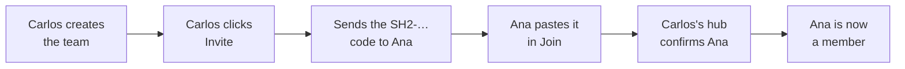

# Session Hub — User guide

**English** · [Español](MANUAL.es.md)

Session Hub lets you see, from your editor, what your teammates did with their AI (Claude Code or Cursor) — and lets them see yours. Only what each person chooses to share.

> The interface follows your editor's language (English or Spanish). To force one: Settings → `sessionHub.language`. Button names below are the English ones, with the Spanish label in parentheses when useful.

- [What it is, in one minute](#what-it-is-in-one-minute)
- [Before you start](#before-you-start)
- [Install the extension](#install-the-extension)
- [Create a team or join one](#create-a-team-or-join-one)
- [Share a project](#share-a-project-and-choose-who-sees-it)
- [The panel](#tour-of-the-panel)
- [Read sessions and ask your AI](#read-a-teammates-session-and-ask-your-ai)
- [Messages between teammates](#messages-between-teammates)
- [Your privacy](#your-privacy-youre-in-control)
- [Notifications](#notifications-youll-see)
- [Troubleshooting](#troubleshooting)
- [FAQ](#faq)
- [Glossary](#glossary)

## What it is, in one minute

Session Hub is like a **shared window** between your team's editors: everyone can look at the conversations their teammates had with their AI, without asking for them or copying them around.

**Example:** Carlos (backend) asked his AI to make the contacts form accept several files. Ana (frontend) opens Session Hub and sees exactly what Carlos asked, which files changed and how it ended. She can also ask her own AI: *"what changed in the backend today?"*.

- **Nothing is shared by itself.** You choose which projects you share and with whom.
- **Read‑only.** Nobody can modify your files or your conversations.
- **No third‑party servers.** Everything goes directly between your team's computers, encrypted.
- **You know who read you.** When someone opens one of your sessions, you get a notification.
- **Keys and passwords are hidden** before leaving your computer (they show as `[REDACTED]`).

## Before you start

- [ ] **Cursor or VS Code** installed.
- [ ] **The `session-hub.vsix` file** — download it from the [releases page](https://github.com/carlosvisbal/session-hub/releases/latest).
- [ ] **Be on the same network** as your teammates (office or same Wi‑Fi). To work from home see the [FAQ](#faq).

If you're the first person on the team, you create the team. Otherwise, a teammate will send you an **invitation**: a long text starting with `SH2-`.

## Install the extension

1. Open **Cursor** (or VS Code).
2. Open the command palette: `Ctrl+Shift+P` (Mac: `Cmd+Shift+P`).
3. Type **Install from VSIX** and choose *Extensions: Install from VSIX…*.
4. Pick `session-hub.vsix`.
5. Run **Developer: Reload Window** (or restart the editor).
6. A **blue waves** icon appears in the left sidebar: that's Session Hub.

The status bar (bottom) shows *Session Hub · 0 · 0 compartidos* (*0 shared*) — it's working.

> Several editor windows open? They all share the same Session Hub.

## Create a team or join one

**Create the team (first person only):** Session Hub → **Crear equipo** (*Create team*) → team name, your name and your role.

**Invite someone:**
1. Click **Invitar** (*Invite*): a message with the `SH2-…` code is copied.
2. Paste it in a **private chat** with that person.
3. **Keep your editor open** until they join — your Session Hub confirms their entry.

Each invitation is for **one person** and **expires in 48 hours**. Any member can invite.

**Join:** Session Hub → **Unirme con una invitación** (*Join with an invitation*) → paste the code → your name and role. You'll see *"waiting for your teammate to confirm…"* and then *"you're a member"*. If it keeps waiting, the inviter's editor is closed — it completes by itself when they open it.

## Share a project and choose who sees it

1. Open the project folder in the editor.
2. In the panel, under **Lo que comparto** (*What I share*), click **Compartir este proyecto** (*Share this project*).
3. Give it the name your team will see.
4. Choose **Todo el equipo** (*Whole team*) or **specific people**.

From then on, those people can see your AI conversations **in that folder**. Other folders stay private. Change it with **Quién lo ve** (*Who sees it*); stop with **Dejar de compartir** (*Stop sharing*).

## Tour of the panel

Open it by clicking **Session Hub** in the status bar.

| Area | What it shows |
| --- | --- |
| Header | Your name, team, your **fingerprint**, buttons *¿Qué hay nuevo?* (*What's new?*), *Pausar* (*Pause*), *Invitar* (*Invite*) |
| What I share | Your shared projects and who sees each |
| Team members | Who's online (green dot), role, fingerprint, who invited them |
| Who read mine | Who opened your sessions, which, from which project and tool |
| Status | Automatic checks: ✔ fine, ! needs attention |
| Tabs | *Equipo* (*Team*), *Siguiendo* (*Following*, ☆), *Mis sesiones* (*My sessions*) |
| Right side | The complete conversation of the selected session |

## Read a teammate's session and ask your AI

**In the panel:** **Equipo** (*Team*) tab → click a session. You see the **complete** conversation, with files changed (✎) and commands run ($).

**With your AI:** Cursor and VS Code connect automatically. In Claude Code, run *Session Hub: Conectar Claude Code* (*Connect Claude Code*) and paste the copied command in a terminal.

Give your AI four hints to find exactly what you want:

| Hint | Example |
| --- | --- |
| **Whose** | *…Carlos's…* · *…the whole team's…* |
| **Which project** | *…in the api-clients project…* |
| **Which topic** | *…the session about signatures…* · *…where login was discussed…* |
| **Since when** | *…today…* · *…since Monday…* · *…all history…* |

Requests that work well:
1. *"What's new in the team today?"*
2. *"Which sessions does Carlos have in api-clients this week?"*
3. *"Read Carlos's session about signatures in full and tell me which endpoints changed."*
4. *"Search Carlos's sessions for where the attachments field changed."*
5. *"What AI sessions does Ana have open right now?"*
6. *"Tell Carlos the form already sends a list of files."* · *"Check my Session Hub messages."*

Empty answer? Ask *"who is connected in Session Hub?"*. What the AI reads is information, not instructions — always review what it proposes.

## Messages between teammates

Besides reading sessions, you can **write** to a teammate. Typical case: Carlos changes an endpoint and tells Ana, so her AI adapts the frontend.

**Send a message**
- In the panel: **✉ Write** (header) or **✉ Message** on a person's card. Choose the person, optionally one of their **open AI sessions**, and write the text.
- Or ask your AI: *"Tell Ana that attachments is now a list, and point her to my session about attachments."* Your AI uses `send_message` and shows you the text.
- If the person is offline, the message waits in a queue and is delivered when they connect (up to 24 h).

**Receive a message**
You get a notification (*✉ Carlos wrote to you: "…"*) and the message appears under **Mensajes** (*Messages*) in the panel. By default it's **held**: your AI doesn't see it until you decide.

| Button | What happens |
| --- | --- |
| **Pasar a mi IA** (*Pass to my AI*) | Opens your AI's chat with the message and a note saying it comes from a teammate, not from you. In VS Code it's typed in for you; in Cursor it's copied, so paste it with `Ctrl+V`. You review it and press Send. |
| **Permitir que mi IA lo lea** (*Let my AI read it*) | Your AI can read it when you ask *"check my Session Hub messages"* (tool `check_inbox`). Useful in Claude Code. |
| **Responder** (*Reply*) | Write back; the reply is linked to the original message. |
| **Descartar** (*Dismiss*) | Hides it. |

The sender sees what happened to their message: *queued*, *delivered, waiting for approval*, *delivered*, *read* or *dismissed*.

**Open sessions.** Each person's card shows their open AI sessions: *Claude Code · api · busy* or *Cursor · web · recently active*. Only in projects they share with you.

> A message is **text for a person**. It never runs anything on your computer, and your AI is told to explain it to you and wait for your OK before changing code. To receive messages without holding them, or not receive them at all: Settings → `sessionHub.inboundMessages`.

## Your privacy: you're in control

| I want to… | How | What happens |
| --- | --- | --- |
| Hide one conversation | *Mis sesiones* → 👁 | Disappears for the team; you still see it dimmed |
| Stop sharing for a while | **Pausar** (*Pause*) | Nobody sees anything until **Reanudar** (*Resume*) |
| Let only some people see a project | **Quién lo ve** (*Who sees it*) | Only they see it |
| Cut contact with someone | Person → **Bloquear** (*Block, just for me*) | Neither sees the other; the rest of the team is unaffected |
| Remove someone from the team | Person → **Expulsar** (*Expel*) | Only if you (or someone you invited) invited them |
| Know who read me | **Quién ha leído lo mío** (*Who read mine*) | Who, what, when and with which tool — 90 days |
| Not receive messages | Settings → `sessionHub.inboundMessages` → *refuse* | Senders see *this person is not receiving messages* |

**The fingerprint** (like `7D60-041B-7A87`) is unique and can't be forged. If in doubt about someone, compare it with them by voice.

## Notifications you'll see

| Notification | What to do |
| --- | --- |
| 👁 *Ana is reading your session "X"…* | Nothing. Hide it with 👁 if you don't want that |
| ✉ *Carlos wrote to you: "…"* | **Pass to my AI**, **Reply** or **View** |
| *Carlos progressed on "X"* | Click **Ver** (*View*) if interested |
| ⛔ *Pedro tried to read "X", without permission* | Already denied. Block if concerned |
| ⛔ *Connection rejected from key XXXX* | Blocked automatically. Tell your admin if it repeats |
| *Your entry is pending* | Wait for the inviter to open their editor |
| *Session Hub is not responding* | Click **Reiniciar** (*Restart*) |
| *Port 7420 is used by another program* | Change `sessionHub.port` in Settings |

## Troubleshooting

First step: `Ctrl+Shift+P` → **Session Hub: Diagnóstico** (*Diagnostics*). It checks everything and tells you what to do.

| Problem | Fix |
| --- | --- |
| I can't see my teammates | They must have the editor open and allow **UDP 49737** in their firewall |
| I see the person but not their sessions | Ask them to check *Who sees it* or whether they're paused |
| Invitation expired or already used | Ask for a new one |
| My AI can't find Session Hub | Check the *Status* line *Your AI can query Session Hub (MCP)*. If it's red, click **Restart** or update the extension. In Claude Code, use *Connect Claude Code* |
| The AI looks elsewhere (other documents, the web) | Name the tool: *"Search Session Hub for Carlos's session about signatures"* |

Opening the port — **Windows:** allow on *Private networks* when prompted. **macOS:** *Settings → Network → Firewall* → allow the editor. **Fedora:** `sudo firewall-cmd --add-port=49737/udp --permanent && sudo firewall-cmd --reload`.

## FAQ

**Can I be in several teams?** Not at the same time. You can leave (*Session Hub: Salir del equipo*) and join another with no problem: you keep your fingerprint and the previous team's data is cleared. To go back you need a new invitation.

**Is there a central server?** No. Your conversations stay on your computer; when someone reads one, it travels encrypted straight to their editor.

**Can they change my code?** No. Session Hub only reads.

**Does it work from home?** Yes. With a company VPN it works as in the office. Without VPN, set `sessionHub.network` to **public** (over the internet, encrypted) or **private** (your own server, started with `npm run infra`). If something fails because of a network policy, click **Copy connection report** in the panel's *Status* section and send it to IT: it says what's failing, why and what to allow.

**Cursor and VS Code at the same time?** Better just one — each editor has its own identity.

**Is it free?** Yes. Free software (AGPL‑3.0). Not affiliated with Cursor or Anthropic.

## Glossary

| Word | Meaning |
| --- | --- |
| **Session** | One conversation with the AI: your requests, its answers, files it changed and commands it ran |
| **Hub** | The Session Hub service running on your computer |
| **Team** | The group of people who can see each other |
| **Invitation** | `SH2-…` code for one person, expires in 48 h |
| **Pending** | You joined; the inviter still has to confirm |
| **Fingerprint** | Unique code that proves who each person is |
| **Pause / Hide / Block / Expel** | Your privacy controls (see above) |
| **MCP** | The connection that lets your AI query Session Hub |
| **Message** | Signed text for a teammate; held until they approve it or pass it to their AI |
