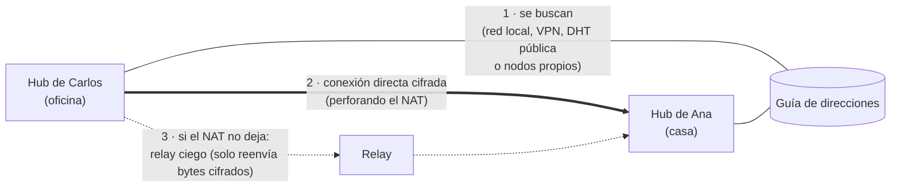

# Trabajar desde redes distintas

[English](REMOTE.md) · **Español**

Session Hub conecta las computadoras del equipo **directamente y cifrado** (Hyperswarm + Noise). No hay un servidor que guarde tus sesiones. Lo único que cambia entre una red y otra es **cómo se encuentran** los hubs.

## Elegir el modo

| Tu caso | Modo (`sessionHub.network`) | Qué hace falta |
| --- | --- | --- |
| Misma oficina o mismo Wi-Fi | `lan` (por defecto) | UDP `49737` permitido en el firewall |
| Cada uno en su casa, pero con **la VPN de la empresa** | `lan` | Estar conectados a la VPN (Session Hub detecta y anuncia la dirección de la VPN) |
| Redes distintas, sin VPN, **para probar ya** | `public` | Salida UDP a internet |
| Redes distintas, **uso diario y con control** | `private` | Un servidor pequeño propio con `npm run infra` |

**Importante:** todos los del equipo deben usar **el mismo modo**. Si no, *Estado* avisa *"modo de red distinto"*. La invitación `SH2-…` ya lleva el modo de quien invita.



## Paso a paso

### Con VPN (lo más simple)
1. Los dos se conectan a la VPN.
2. Dejan `sessionHub.network` en `lan`.
3. Listo: funciona igual que en la oficina.

### Por internet, sin montar nada (`public`)
1. Los dos cambian `sessionHub.network` a `public` (Ajustes → buscar *sessionHub.network*).
2. Session Hub reinicia solo la conexión (no hace falta reiniciar el editor).
3. En *Estado* deben ver *"Conexión cifrada con el equipo · red pública"* y al compañero en línea.

El contenido va siempre cifrado de extremo a extremo. La red pública solo ve que tu IP participa en un "tema"; para no exponer ni eso, usa `private`.

### Con servidor propio (`private`)
En una máquina con IP pública o de VPN (un VPS pequeño basta), con el código de Session Hub:

```bash
npm install
npm run infra -- --host 203.0.113.10          # la IP pública (o de VPN) de ese servidor
```

Esto levanta:
- **3 nodos de arranque** en UDP `49737–49739`: la "guía de direcciones" del equipo.
- **Un relay ciego** en UDP `49740`, para cuando dos routers no permiten la conexión directa. Su clave se guarda en `~/.session-hub/relay-key.json`, así que no cambia al reiniciar.

Al terminar, imprime los ajustes que deben poner **todos** los del equipo:

```json
"sessionHub.network": "private",
"sessionHub.bootstrap": ["203.0.113.10:49737"],
"sessionHub.relay": "9f53275e20d1…"
```

Opciones: `--port 49737` (primer puerto), `--nodes 3` (cantidad de nodos), `--no-relay`, o `--public` (solo un relay, sobre la red pública, para usar con el modo `public`).

En el firewall del servidor abre UDP `49737–49740` (o los que correspondan a `--port` y `--nodes`). Mantén el proceso siempre encendido, por ejemplo con systemd o pm2.

## Qué pasa al conectar
1. Cada hub busca al otro por la clave del equipo.
2. Intentan **perforar el NAT** (hole punching) para hablarse directamente. En la mayoría de las redes caseras y de oficina funciona.
3. Si el NAT es muy estricto (algunas redes corporativas, de celular o con NAT de operador) y hay un **relay** configurado, la conexión se reintenta por el relay. El relay **no puede leer nada**: solo empareja dos flujos y reenvía bytes cifrados de extremo a extremo.
4. Con pocos compañeros la búsqueda puede tardar: Session Hub vuelve a buscar cada 30 s y marca directo a las direcciones conocidas cada 15 s.

## Si no se conectan
Abre *Estado*. Cada problema aparece con su causa y qué hacer:

| Aviso | Causa probable | Qué hacer |
| --- | --- | --- |
| UDP bloqueado | El firewall no deja salir UDP | Pedir a TI que permita UDP saliente (o el puerto `49737`) |
| No se alcanza el servidor de arranque | Modo `private` y el servidor está apagado, o su puerto está cerrado | Encender `npm run infra` y abrir sus puertos UDP |
| NAT estricto / fallo de perforación | Los dos routers no permiten la conexión directa | Configurar un relay (`sessionHub.relay`) o usar VPN |
| Relay inalcanzable | El relay está apagado o bloqueado | Revisar el servidor del relay y su puerto UDP |
| Modo de red distinto | Uno usa `lan` y otro `public`, por ejemplo | Poner el mismo modo en todos |
| Compañero no encontrado | Su editor está cerrado o su red lo bloquea | Que abra el editor y revise su *Estado* |

**Copiar informe de conexión** (en *Estado*) genera un texto listo para mandarle a TI: qué falla, por qué, qué deben permitir y los detalles técnicos (modo, direcciones, tipo de NAT, errores recientes).

## Qué pedirle a TI
- **Modo `lan` o VPN:** permitir UDP `49737` entre las computadoras del equipo.
- **Modo `public`:** permitir UDP saliente a internet.
- **Modo `private`:** permitir UDP hacia el servidor propio (los puertos que imprime `npm run infra`).
- En ningún caso hace falta abrir puertos **entrantes** en las computadoras del equipo, ni TCP. La API local (puerto `7420`) solo escucha en `127.0.0.1`.

## Estado de las pruebas
Las pruebas automáticas cubren la red local, los nodos propios y el relay forzado, en una misma computadora. **Todavía no se validó entre dos computadoras reales en redes distintas**: si lo pruebas y algo falla, el informe de conexión de *Estado* dice exactamente en qué paso.
