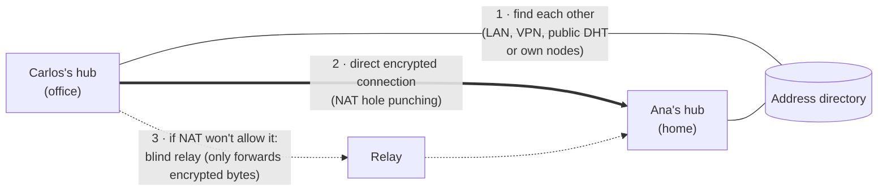

# Working across different networks

**English** · [Español](REMOTE.es.md)

Session Hub connects your team's computers **directly and encrypted** (Hyperswarm + Noise). No server stores your sessions. The only thing that changes from one network to another is **how the hubs find each other**.

## Pick the mode

| Your case | Mode (`sessionHub.network`) | What you need |
| --- | --- | --- |
| Same office or same Wi‑Fi | `lan` (default) | UDP `49737` allowed in the firewall |
| Each at home, but on **the company VPN** | `lan` | Be on the VPN (Session Hub detects and advertises the VPN address) |
| Different networks, no VPN, **to try it now** | `public` | Outbound UDP to the internet |
| Different networks, **daily use with control** | `private` | A small server of your own running `npm run infra` |

**Important:** everyone on the team must use **the same mode**; otherwise *Status* warns *"different network mode"*. The `SH2-…` invitation already carries the inviter's mode.



## Step by step

### With a VPN (simplest)
1. Both connect to the VPN.
2. Keep `sessionHub.network` on `lan`.
3. Done: it works like at the office.

### Over the internet, nothing to set up (`public`)
1. Both set `sessionHub.network` to `public` (Settings → search *sessionHub.network*).
2. Session Hub restarts only the connection (no editor restart needed).
3. *Status* should show *"Encrypted team connection · public network"* and the teammate online.

Content is always end‑to‑end encrypted. The public network only sees that your IP takes part in a "topic"; to avoid even that, use `private`.

### With your own server (`private`)
On a machine with a public or VPN IP (a small VPS is enough), with Session Hub's code:

```bash
npm install
npm run infra -- --host 203.0.113.10          # that server's public (or VPN) IP
```

It starts:
- **3 bootstrap nodes** on UDP `49737–49739`, the team's "address directory".
- **A blind relay** on UDP `49740`, for when two routers don't allow a direct connection. Its key is stored in `~/.session-hub/relay-key.json`, so it doesn't change on restart.

When done it prints the settings **everyone** on the team must use:

```json
"sessionHub.network": "private",
"sessionHub.bootstrap": ["203.0.113.10:49737"],
"sessionHub.relay": "9f53275e20d1…"
```

Options: `--port 49737` (first port), `--nodes 3` (number of nodes), `--no-relay`, or `--public` (only a relay on the public network, to use with `public` mode).

Open UDP `49737–49740` on the server's firewall (or the ports matching `--port` and `--nodes`). Keep the process running, e.g. with systemd or pm2.

## What happens when connecting
1. Each hub looks for the other by the team key.
2. They try **NAT hole punching** to talk directly; it works on most home and office networks.
3. If the NAT is very strict (some corporate, mobile or carrier‑grade NAT networks) and a **relay** is configured, the connection is retried through it. The relay **can't read anything**: it only pairs two streams and forwards end‑to‑end encrypted bytes.
4. With few teammates discovery can take a moment: Session Hub searches again every 30 s and dials known addresses directly every 15 s.

## If they don't connect
Open *Status*. Each problem shows its cause and what to do:

| Warning | Likely cause | What to do |
| --- | --- | --- |
| UDP blocked | The firewall blocks outbound UDP | Ask IT to allow outbound UDP (or port `49737`) |
| Bootstrap server unreachable | `private` mode and the server is off or its port is closed | Start `npm run infra` and open its UDP ports |
| Strict NAT / hole punching failed | Both routers prevent a direct connection | Configure a relay (`sessionHub.relay`) or use a VPN |
| Relay unreachable | The relay is off or blocked | Check the relay server and its UDP port |
| Different network mode | One uses `lan`, another `public`, for example | Use the same mode everywhere |
| Teammate not found | Their editor is closed or their network blocks it | Ask them to open the editor and check their *Status* |

**Copy connection report** (in *Status*) produces a ready‑to‑send text for IT: what fails, why, what to allow, and technical details (mode, addresses, NAT type, recent errors).

## What to ask IT
- **`lan` mode or VPN:** allow UDP `49737` between the team's computers.
- **`public` mode:** allow outbound UDP to the internet.
- **`private` mode:** allow UDP to your own server (the ports `npm run infra` prints).
- Never needed: **inbound** ports on the team's computers, or TCP. The local API (port `7420`) only listens on `127.0.0.1`.

## Test status
Automated tests cover the local network, own bootstrap nodes and a forced relay, on a single computer. **It hasn't yet been validated between two real computers on different networks**: if you try it and something fails, the *Status* connection report says exactly at which step.
