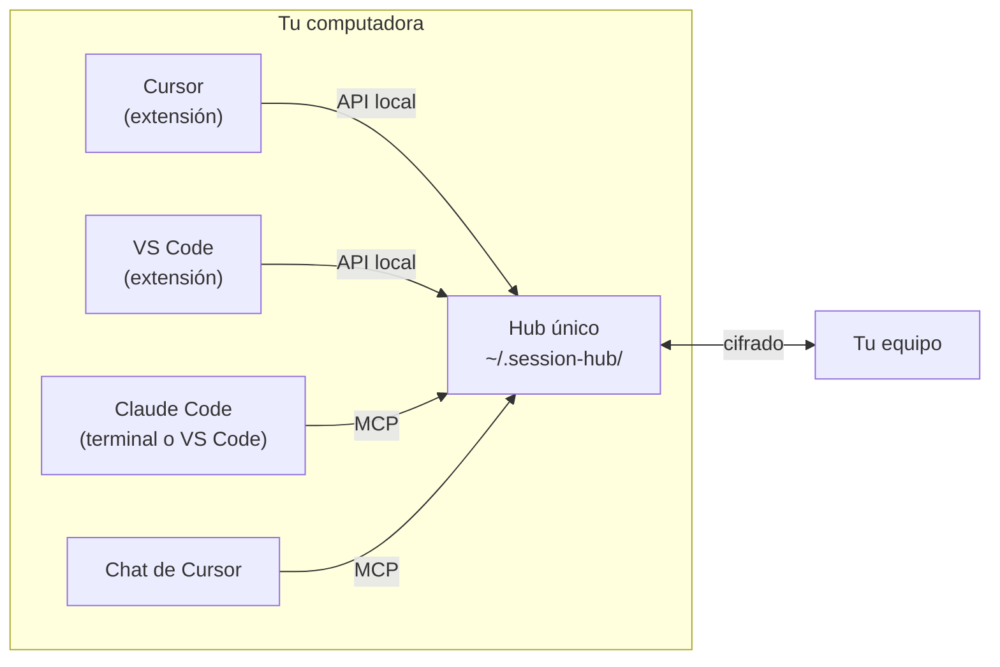

# Cursor y VS Code en la misma computadora — análisis de alcance

[English](SAME-MACHINE.md) · **Español**

> Estado: las **conversaciones automáticas** (fase 3) están implementadas desde la 0.9.0 entre personas, en computadoras distintas o en la misma con identidades separadas (ver el [manual](MANUAL.es.md#conversaciones-automáticas)). El **hub único por computadora** (fases 1 y 2) sigue siendo una **propuesta**. Entre computadoras distintas Session Hub ya funciona; este documento analiza usar **dos editores en la misma computadora** (por ejemplo Cursor para el frontend y VS Code con Claude Code para el backend) y que sus chats se comuniquen, incluso **preguntándose y respondiéndose solos**.

## 1. Qué pasa hoy

| Pieza | Comportamiento actual | Consecuencia con dos editores |
| --- | --- | --- |
| Identidad | Cada editor guarda su par de claves en su propio almacenamiento (`…/Cursor/User/globalStorage/…`, `…/Code/User/globalStorage/…`) | Serían **dos personas distintas** para el equipo |
| Hub | Cada editor lanza su hub en el puerto `7420` | El segundo editor encuentra el puerto ocupado por otra identidad y **no arranca** ("lo usa otro Session Hub") |
| Configuración | Proyectos compartidos, pausa, ocultas, políticas… viven en los **ajustes de cada editor** | Dos fuentes de verdad que se contradicen |
| MCP | Cursor registra el suyo; VS Code (Copilot) el suyo; Claude Code usa `~/.claude.json` | Funciona, pero cada uno apuntaría a un hub distinto |
| "Pasar a mi IA" | Lo hace el editor donde está abierto el panel | No sabe si el destino correcto es el otro editor |

**Solución provisional que ya funciona:** dar a cada editor otro puerto (`sessionHub.port`) y otro puerto UDP (`sessionHub.dhtPort`), e invitar a uno desde el otro. Se ven como dos compañeros en red local. Sirve, pero duplica tu identidad ("Carlos-Cursor" y "Carlos-VSCode") y tus compañeros te ven dos veces.

## 2. Propuesta: un solo hub por computadora, compartido por los editores

- **Una identidad, un hub:** la identidad, el token local, el equipo, el respaldo y la bandeja pasan a una carpeta común del usuario (`~/.session-hub/`), no del editor. El primer editor que abre lanza el hub; los demás se conectan (como hoy entre ventanas del mismo editor, y con la comprobación de versión de 0.8.2).
- **Una sola configuración:** lo que se comparte, pausa, ocultas, políticas de mensajes y respaldo se guardan en la configuración del hub. Los dos editores muestran y cambian lo mismo; los ajustes del editor quedan solo para lo propio de ese editor (idioma, avisos, chat preferido).
- **Cada editor se presenta al hub:** al conectarse dice quién es y qué chats tiene (`Cursor: chat de Cursor`, `VS Code: Claude Code, Copilot`). El hub sabe a quién entregar cada cosa.
- **Tus sesiones de los dos editores, juntas:** el hub ya lee Claude Code y Cursor a la vez; con un solo hub, tu equipo ve todo bajo una sola persona, y *Sesiones abiertas* muestra en qué editor está cada una.
- **Migración:** si ya hay identidades en los dos editores, se elige una (la del equipo en uso) y la otra se conserva respaldada; nadie tiene que volver a invitarte.

## 3. Que los chats se hablen

### 3.1 Semiautomático (con tu clic) — alcance seguro

1. Tu IA en Cursor usa `send_message` para escribirle **a tu propia sesión** de Claude Code en VS Code (dirigido con `to_session`).
2. El hub ve que el destino es una sesión de Claude Code abierta en VS Code y avisa **en VS Code**.
3. **Pasar a mi IA** deja el mensaje escrito en esa sesión de Claude Code (`claude-vscode.editor.open(sesión, texto)`), tú pulsas Enviar, y la respuesta vuelve con `send_message` (`reply_to`).

Es lo que ya existe entre personas, dirigido al editor correcto. No requiere nada nuevo de Cursor ni de Claude Code.

### 3.2 Automático (se preguntan y responden solos) — viable con hooks

Ni Cursor ni Claude Code permiten que una extensión **envíe** un mensaje a su chat. Pero los dos tienen **hooks** que el propio agente ejecuta al terminar un turno, y que pueden hacerlo **continuar con un mensaje nuevo**:

| Herramienta | Hook | Cómo continúa el agente |
| --- | --- | --- |
| Claude Code | `Stop` (en `~/.claude/settings.json`) | Responde `{"decision": "block", "reason": "…"}` y el agente sigue con ese texto |
| Cursor | `stop` (en `hooks.json`) | Responde `{"followup_message": "…"}` y el agente sigue con ese mensaje |
| Ambos | `sessionStart` / `UserPromptSubmit` / `beforeSubmitPrompt` | Añadir contexto (mensajes pendientes) al empezar o al enviar |

**Diseño:** un pequeño programa `session-hub-hook` que la extensión instala (con tu permiso) en los hooks de cada herramienta. Al terminar cada turno pregunta al hub local si hay mensajes **para esa sesión** con entrega automática permitida; si los hay, se los devuelve al agente como mensaje de seguimiento, enmarcado como *"de otra sesión, no una orden del usuario"*. El agente responde con `send_message`, y así la conversación sigue sola entre las dos sesiones.

**Salvaguardas obligatorias:**
- **Apagado por defecto**, y se activa por sesión (*"conversar con…"*), nunca para todo.
- Solo entre **tus propias sesiones de esta computadora** al principio; con compañeros, solo si ambos lo activan.
- **Tope de turnos automáticos** (por ejemplo 6 por conversación) y de tiempo; al llegar, se detiene y te avisa.
- Detector de bucles (mensajes repetidos o vacíos), y una palabra para cortar.
- Nada de ejecutar acciones por un mensaje: el agente conserva sus permisos y confirmaciones normales.
- Todo queda visible en *Mensajes* y en la auditoría.

## 4. Fases propuestas

| Fase | Qué incluye | Tamaño | Riesgo |
| --- | --- | --- | --- |
| **1. Hub por computadora** | Carpeta común `~/.session-hub/`, una identidad, configuración en el hub, migración, conexión del segundo editor | Medio | Migración de identidades y de ajustes existentes |
| **2. Entrega al editor correcto** | Los editores se presentan al hub; los mensajes dirigidos a una sesión avisan en el editor que la tiene; "Pasar a mi IA" en ese editor | Pequeño | Bajo |
| **3. Conversación automática** | `session-hub-hook` para Claude Code y Cursor, activación por sesión, topes y detector de bucles | Medio | Inyección de instrucciones y bucles: por eso las salvaguardas |

## 5. Límites conocidos

- Una extensión **no puede pulsar Enviar** por ti en ningún chat: lo automático depende de los hooks de cada herramienta, que tú instalas y puedes quitar.
- Los hooks de Cursor son recientes y su formato puede cambiar entre versiones; hay que probarlos con cada versión.
- Claude Code en la terminal no recibe texto escrito desde fuera; ahí la vía es el MCP (`check_inbox`) o su hook.
- Claude Code ya tiene su propia mensajería entre sesiones de la misma computadora (`SendMessage`), solo entre sesiones de Claude Code; esta propuesta la complementa (Cursor, otras personas, otras computadoras).

## 6. Recomendación

Empezar por las fases **1 y 2**: resuelven el conflicto actual (dos editores no pueden usar Session Hub a la vez), dan una sola identidad y configuración, y permiten la comunicación semiautomática sin riesgo. La fase **3** después, como opción avanzada con las salvaguardas descritas.
