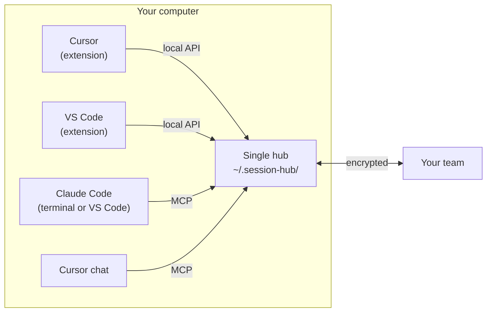

# Cursor and VS Code on the same computer — scope analysis

**English** · [Español](SAME-MACHINE.es.md)

> Status: **proposal**, not implemented. Session Hub already works between different computers; this document analyzes using **two editors on the same computer** (e.g. Cursor for frontend and VS Code with Claude Code for backend) and letting their chats talk — even **asking and answering each other automatically**.

## 1. Today

| Piece | Current behavior | With two editors |
| --- | --- | --- |
| Identity | Each editor keeps its key pair in its own storage | They would be **two different people** to the team |
| Hub | Each editor starts its hub on port `7420` | The second editor finds the port taken by another identity and **doesn't start** |
| Settings | Shared projects, pause, hidden sessions, policies live in **each editor's settings** | Two sources of truth that contradict each other |
| MCP | Cursor registers its own; VS Code (Copilot) its own; Claude Code uses `~/.claude.json` | Works, but each would point to a different hub |
| "Pass to my AI" | Done by the editor showing the panel | It doesn't know when the right target is the other editor |

**Workaround that works today:** give each editor a different `sessionHub.port` and `sessionHub.dhtPort`, and invite one from the other. They see each other as two LAN teammates — but your identity is duplicated and teammates see you twice.

## 2. Proposal: one hub per computer, shared by the editors

- **One identity, one hub:** identity, local token, team, backup and inbox move to a per‑user folder (`~/.session-hub/`) instead of per editor. The first editor to open starts the hub; the others attach (as windows of one editor do today, with the 0.8.2 version check).
- **One configuration:** what you share, pause, hidden sessions, message and backup policies live in the hub's config. Both editors show and change the same thing; editor settings keep only editor‑specific things (language, notifications, preferred chat).
- **Each editor introduces itself** to the hub with its available chats (`Cursor: Cursor chat`, `VS Code: Claude Code, Copilot`), so the hub knows where to deliver.
- **Both editors' sessions together** under one person; *Open sessions* shows which editor each one is in.
- **Migration:** if both editors already have identities, one is kept (the one in the active team) and the other is backed up; nobody has to invite you again.

## 3. Letting the chats talk

### 3.1 Semi‑automatic (your click) — safe scope

1. Your AI in Cursor calls `send_message` to **your own** Claude Code session in VS Code (`to_session`).
2. The hub sees the target is a Claude Code session open in VS Code and notifies **in VS Code**.
3. **Pass to my AI** types the message into that Claude Code session (`claude-vscode.editor.open(session, text)`); you press Send; the answer comes back with `send_message` (`reply_to`).

### 3.2 Automatic (they ask and answer on their own) — feasible with hooks

Neither Cursor nor Claude Code lets an extension **send** a chat message. But both run **hooks** at the end of each agent turn that can make it **continue with a new message**:

| Tool | Hook | How the agent continues |
| --- | --- | --- |
| Claude Code | `Stop` (`~/.claude/settings.json`) | Return `{"decision": "block", "reason": "…"}` |
| Cursor | `stop` (`hooks.json`) | Return `{"followup_message": "…"}` |
| Both | `sessionStart` / `UserPromptSubmit` / `beforeSubmitPrompt` | Add context (pending messages) at start or on submit |

**Design:** a small `session-hub-hook` program the extension installs (with your consent) into each tool's hooks. After each turn it asks the local hub for messages **for that session** with automatic delivery allowed, and returns them as a follow‑up framed as *"from another session, not an order from the user"*. The agent answers with `send_message`, and the conversation continues between the two sessions.

**Mandatory safeguards:** off by default and enabled per session; at first only between **your own sessions on this computer**; a cap on automatic turns (e.g. 6) and time; loop detection and a stop word; messages never bypass the agent's normal permissions; everything visible in *Messages* and the audit log.

## 4. Phases

| Phase | Includes | Size | Risk |
| --- | --- | --- | --- |
| **1. Hub per computer** | Shared `~/.session-hub/`, one identity, config in the hub, migration, second editor attaches | Medium | Migrating existing identities and settings |
| **2. Deliver to the right editor** | Editors register with the hub; messages for a session notify the editor that has it | Small | Low |
| **3. Automatic conversation** | `session-hub-hook` for Claude Code and Cursor, per‑session opt‑in, caps and loop detection | Medium | Prompt injection and loops — hence the safeguards |

## 5. Known limits

- An extension **can't press Send** in any chat: automation relies on each tool's hooks, which you install and can remove.
- Cursor hooks are recent and their format may change; they must be tested per version.
- Claude Code in a terminal can't receive typed text from outside; there the path is MCP (`check_inbox`) or its hook.
- Claude Code has its own same‑machine messaging (`SendMessage`), only between Claude Code sessions; this proposal complements it (Cursor, other people, other computers).

## 6. Recommendation

Start with phases **1 and 2**: they fix today's conflict (two editors can't run Session Hub at once), give one identity and configuration, and enable semi‑automatic communication with no risk. Phase **3** afterwards, as an advanced option with the safeguards above.
